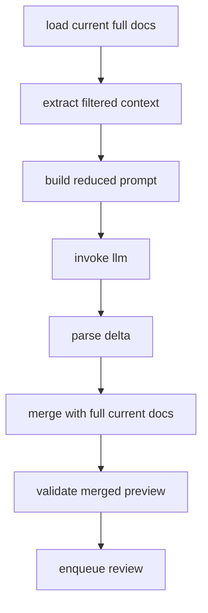

# 减少上下文与增量归并方案

## 1. 背景

当前批处理链路会把完整的上一版 `actors` 与 `worldinfo` YAML 连同当前章节正文一起注入提示词，见 `src/epub2yaml/llm/chains/document_update_chain.py` 与 `src/epub2yaml/workflow/graph.py`。随着批次推进，已有 YAML 越来越大，LLM 在长上下文下对后段字段的注意力下降，出现以下问题：

- 越往后处理，输出字段越少
- 已存在字段在模型输出里被漏掉
- 轻微变更也需要模型重复携带大量不变信息
- 数组字段缺少稳定归并语义，难以做到细粒度更新

本方案目标不是重做整条工作流，而是在现有 Delta 工作流上增加一层上下文裁剪与更细粒度的增量归并机制。

## 2. 现状定位

### 2.1 当前上下文注入点

现有上下文注入路径如下：

- `src/epub2yaml/workflow/graph.py` 中的 `load_current_documents`
- `src/epub2yaml/workflow/graph.py` 中的 `build_prompt`
- `src/epub2yaml/workflow/graph.py` 中的 `invoke_llm`
- `src/epub2yaml/llm/chains/document_update_chain.py` 中的 `DocumentUpdateRequest`
- `src/epub2yaml/llm/chains/document_update_chain.py` 中的 `DEFAULT_HUMAN_TEMPLATE`

当前 `DocumentUpdateRequest` 直接携带：

- 完整上一版 `actors YAML`
- 完整上一版 `worldinfo YAML`
- 当前批次章节正文

### 2.2 当前归并能力

现有领域层已经具备基础递归归并能力：

- `src/epub2yaml/domain/services.py` 中的 `merge_document`
- `src/epub2yaml/domain/services.py` 中的 `merge_delta_package`
- `src/epub2yaml/domain/services.py` 中的 `parse_delta_yaml`

特点：

- object 可做深度合并
- array 目前整体替换
- merged preview 已在工作流中存在

因此最合适的策略是：

1. 提示词输入改成过滤后的相关上下文
2. 模型只输出变化字段
3. 程序继续基于完整 current 文档做最终 merge preview

## 3. 目标

### 3.1 主要目标

- 显著减少每次提示词中的历史 YAML 体积
- 降低模型因长上下文导致的字段遗漏
- 让模型只输出变化字段或变化子树
- 保持现有 Delta 解析与 merged preview 工作流兼容
- 为数组字段提供可落地的首版归并分层策略

### 3.2 非目标

本次首版不做：

- 全自动语义检索式上下文召回
- 所有数组都支持元素级智能 merge
- 删除语义与数组重排语义的全面重构
- 改变最终 YAML 的对外结构格式

## 4. 方案总览

核心思想：

1. 程序仍然读取完整 current 文档
2. 但提示词只注入与当前章节最相关的角色和设定片段
3. LLM 只返回变更字段，而不是完整条目
4. 程序使用完整 current 文档与 delta 做最终 merge
5. 审阅看到的仍然是完整 merged preview，而不是裁剪后的局部视图

## 5. 上下文裁剪策略

## 5.1 设计原则

- 裁剪发生在提示词输入阶段，不改变 merge 阶段的完整性
- 优先基于显式关键字命中，而不是复杂推理
- 命中不到时回退到极小上下文，而不是全量回灌
- 命中过多时要截断，避免重新膨胀成大上下文

## 5.2 actors 裁剪规则

对于 `actors`：

1. 优先使用 `trigger_keywords` 与章节正文做关键词命中
2. 若 `trigger_keywords` 缺失，可回退到角色名别名匹配：
   - 英文名
   - 日文名
   - 中文名
   - 罗马音
3. 命中后将该角色的完整当前条目纳入 filtered actors context
4. 若一个角色多次命中，则提高排序优先级

### 5.2.1 建议排序因子

命中排序可按以下顺序综合：

- 命中次数
- 是否命中 `trigger_keywords`
- 是否命中多个别名
- 是否在多个章节片段中被命中

### 5.2.2 截断策略

当命中角色过多时：

- 只保留 Top N 角色
- N 建议做成配置项
- 被截断的角色写入 warning 信息，供审阅与调试使用

## 5.3 worldinfo 裁剪规则

对于 `worldinfo`：

1. 使用 `keys` 与章节正文做关键词命中
2. 命中后将该设定条目纳入 filtered worldinfo context
3. 无 `keys` 的 worldinfo 条目默认不直接召回，除非后续增加兜底规则

### 5.3.1 worldinfo 截断策略

- 同样按命中次数排序
- 仅保留最相关条目
- 过量命中写入 warning

## 5.4 未命中兜底

若完全未命中：

- 不回退到完整 current 文档
- 注入极小基础上下文
- 基础上下文可以是：
  - 空的 `actors: {}`
  - 空的 `worldinfo: {}`
  - 或后续极小保底摘要

首版推荐直接使用空结构兜底，保持简单可控。

## 6. 提示词改造方案

## 6.1 需要修改的方向

当前提示词规则中存在一个关键限制：变更条目要求输出完整内容。这个限制会迫使模型反复复制大段不变字段，进一步放大上下文与输出体积。

首版建议将规则调整为：

- 只输出当前批次发生变化的字段或变化子树
- 对于 object，允许只输出局部嵌套字段
- 对于 object array，如只更新某个元素，允许只输出该元素的变化部分
- 对于 array 更新，必须保留用于定位元素的识别字段
- 不要重复输出没有变化的大段历史字段

## 6.2 建议提示词约束

建议在提示词中显式增加以下约束：

1. 仅输出发生变化的字段
2. 不要复述未变化字段
3. 如果更新对象数组中的某项，必须保留识别该项的关键字段
4. 如果某角色或设定未发生变化，不要输出该条目
5. 输出仍保持可被 Delta 解析器接收的 YAML 结构

## 6.3 预期效果

这样做有两个直接收益：

- 输入侧上下文减少
- 输出侧重复字段减少

两端同时降 token，才能真正缓解后期批次字段缺失问题。

## 7. 程序侧归并分层策略

## 7.1 总原则

在现有 `merge_document` 基础上扩展，但不要一步把所有 array 复杂化。首版采用分层规则：

- object 继续深度合并
- scalar array 整字段替换
- 已登记规则的 object array 按识别字段合并
- 未登记规则的 object array 先整字段替换并记录 warning

## 7.2 object 归并

保持现有能力：

- current 与 delta 都是 object 时递归 merge
- 只覆盖变化字段
- 不要求模型输出完整子树

## 7.3 scalar array 归并

以下类型数组归为 scalar array：

- `trigger_keywords`
- `identity`
- `character_brief_description`
- `physical_quirks`
- `style`
- `likes`
- `dislikes`
- `fan_tropes`
- `verbatim_quotes`
- `trivia_facts`
- 其他字符串或数值列表

规则：

- 只要 delta 中出现该字段，就用整个数组替换旧值
- 不做元素级 merge

原因：

- 缺少稳定主键
- 强行 merge 容易误判
- 首版重点是降低上下文，不是穷举所有数组语义

## 7.4 object array 归并

只有纳入规则注册表的路径才做对象数组的元素级 merge。

规则：

1. 先根据路径找到识别字段规则
2. 对 delta 数组中的每一项提取识别字段
3. 命中旧数组已有项时，对该元素递归 merge
4. 未命中时视为新增元素追加
5. 若识别字段缺失，则回退为整字段替换并写 warning

## 7.5 unknown object array 兜底

未登记路径的对象数组：

- 不做智能 merge
- 首版直接整字段替换
- 记录 warning 产物

这样做的原因：

- 可以先把主要收益落地
- 不会因规则不全阻塞整条链路
- 便于之后根据真实高频路径逐步补规则

## 8. 首版对象数组规则注册表建议

以下是建议首批支持元素级归并的路径：

| 路径 | 识别字段 |
|---|---|
| `actors.*.personality_core.personal_traits` | `trait_name + scope` |
| `actors.*.personality_core.internal_conflicts` | `conflict_name + scope` |
| `actors.*.skills_and_vulnerabilities.talents_and_skills` | `category + skill_name` |
| `actors.*.skills_and_vulnerabilities.special_abilities` | `name` |
| `actors.*.skills_and_vulnerabilities.tools_and_equipment` | `item_name` |
| `actors.*.canon_timeline` | `event + timeframe` |
| `actors.*.dialogue_and_quotes.other_dialogue_examples` | `cue + response` |
| `actors.*.sex_history` | `partner + behavior + result` |
| `actors.*.pregnancy` | `weeks + father + race + bloodline` |
| `actors.*.offspring` | `name + dob + father` |

说明：

- 这些路径都属于对象数组
- 都能从 schema 中抽出相对稳定的识别字段
- 首版不要求全覆盖，只要求高频字段先可用

## 9. 工作流接入设计

## 9.1 新增节点

建议在现有工作流中，在 `load_current_documents` 与 `build_prompt` 之间新增一个节点，例如：

- `build_filtered_context`

职责：

- 读取当前批次章节正文
- 分析角色和 worldinfo 关键词命中
- 从完整 current 文档中抽取最小相关上下文
- 生成 filtered actors YAML 与 filtered worldinfo YAML
- 记录裁剪统计与 warning

## 9.2 request 结构扩展

`DocumentUpdateRequest` 建议从当前结构扩展为可区分：

- full current docs 仅供程序内部 merge 使用
- filtered docs 仅供提示词使用

实现上可以有两种方式：

### 方案 A

直接替换传入 `previous_actors_yaml` 与 `previous_worldinfo_yaml` 的内容，让它们承载 filtered context。

优点：

- 改动小
- 兼容现有 prompt 渲染链路

缺点：

- 语义上看不出这是 filtered 结果

### 方案 B

在 request 中显式新增：

- `filtered_actors_yaml`
- `filtered_worldinfo_yaml`

优点：

- 语义更清晰
- 便于后续保留 full 与 filtered 两套上下文

首版推荐方案 B，结构更清楚。

## 9.3 merge preview 保持完整视图

需要明确：

- prompt 使用 filtered context
- merge preview 仍使用完整 current 文档

因此 `merge_delta_preview` 不应基于 filtered context 做 merge，而应继续读取完整 current 文档。这样可以保证：

- 审阅结果是完整最终态
- 没被召回到 prompt 的历史字段不会在 preview 中丢失

## 10. 失败与兜底策略

## 10.1 关键词未命中

处理方式：

- 使用空结构或极小基础上下文
- 记录 warning
- 不自动回退到整库 current 文档

## 10.2 关键词命中过多

处理方式：

- 按命中权重排序
- 截断至上限
- 把被裁掉的条目写 warning

## 10.3 对象数组识别字段缺失

处理方式：

- 当前数组字段整字段替换
- 记录 warning
- 不阻塞整批次

## 10.4 数组路径未登记规则

处理方式：

- 整字段替换
- 记录 warning
- 后续根据 warning 频率补规则注册表

## 10.5 类型不兼容

例如：

- current 是 object 但 delta 是 array
- current 是 array 但 delta 是 object

处理方式：

- 直接失败
- 进入现有失败链路
- 不做静默覆盖

## 11. 建议新增的辅助产物

为了便于调试与后续规则扩展，建议每个批次增加辅助产物：

- `filtered_context_summary.json`
- `merge_warnings.json`

建议内容：

### `filtered_context_summary.json`

- 命中的 actors 列表
- 命中的 worldinfo 列表
- 被截断的条目
- filtered context 大小统计

### `merge_warnings.json`

- 哪些数组路径走了 replace fallback
- 哪些对象数组缺少识别字段
- 哪些条目因命中上限被裁掉

这些产物不影响正式 YAML，只用于调试和规则迭代。

## 12. 测试规划

## 12.1 领域层测试

在 `tests/test_domain_services.py` 增加以下测试：

- object 深度 merge 仍保持兼容
- 已登记对象数组按识别字段命中旧元素并递归 merge
- 已登记对象数组未命中时追加新元素
- 未登记对象数组整字段替换并产出 warning
- 识别字段缺失时整字段替换并产出 warning
- scalar array 始终整字段替换
- 类型不兼容时报错

## 12.2 提示词测试

在 `tests/test_llm_workflow.py` 增加以下测试：

- prompt 中不再注入完整 current 文档
- prompt 仅注入 filtered actors 与 filtered worldinfo
- prompt 明确要求 changed fields only
- prompt 明确要求对象数组更新保留识别字段

## 12.3 端到端测试

在 `tests/test_mvp_pipeline.py` 增加以下测试：

- filtered context 构造正确
- LLM 输出局部 delta 后能基于完整 current 文档得到正确 merged preview
- 未命中的历史字段不会因 prompt 裁剪而在 merged preview 中丢失
- unknown object array 走 replace fallback 时 warning 正确落盘

## 13. 实施步骤

- [ ] 在工作流中新增 filtered context 构造节点
- [ ] 扩展 `DocumentUpdateRequest` 以显式承载 filtered actors 与 filtered worldinfo
- [ ] 改造提示词规则，要求只输出 changed fields
- [ ] 在领域层扩展 array merge 分层能力
- [ ] 新增对象数组规则注册表
- [ ] 为 unknown object array 与识别字段缺失场景增加 warning 机制
- [ ] 为批次产物增加 filtered context 与 merge warning 调试文件
- [ ] 补齐领域层与工作流测试

## 14. 方案优点

- 最大改动发生在 prompt 输入与 merge 语义层，不需要推翻现有工作流
- 可以直接针对长上下文导致的字段缺失问题下手
- filtered context 与 full merge 分离，安全性高
- array 采用分层策略，复杂度可控
- unknown object array 先 replace with warning，便于迭代扩展

## 15. 风险与注意点

- 关键词规则如果过弱，可能召回不足
- 关键词规则如果过宽，可能重新膨胀上下文
- 对象数组识别字段如果选得不稳定，可能误合并
- 首版 replace fallback 虽然安全，但会让部分对象数组仍然输出较大块内容

因此建议先把 warning 产物补齐，再根据真实运行数据逐步扩展规则表。

## 16. 结论

推荐采用以下首版策略：

- 使用章节关键字匹配 current 文档，构造 filtered context
- prompt 只注入 filtered actors 与 filtered worldinfo
- LLM 只输出变化字段或变化子树
- object 继续深度合并
- scalar array 整字段替换
- 已登记规则的 object array 按识别字段 merge
- 未登记 object array 先整字段替换并记录 warning
- merged preview 继续基于完整 current 文档生成

这套方案能够在较小改动范围内显著降低提示词上下文体积，并减少后期批次因长上下文带来的字段缺失问题。