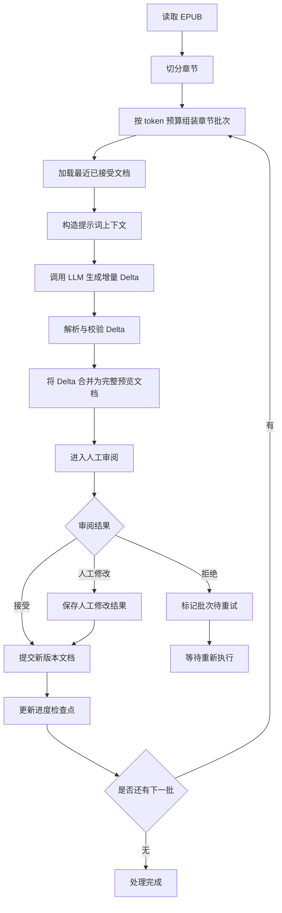
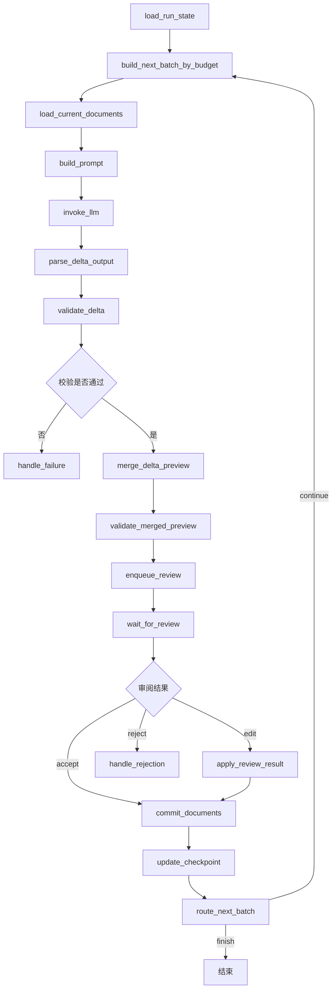

# EPUB 小说转 YAML 文档系统设计文档

## 1. 文档目标

本文档定义一个基于 Python 与 LangGraph 的批处理系统，用于将 EPUB 小说内容按章节分批转换为结构化 YAML 文档。

首版目标聚焦于两类输出：

- `actors`：角色总结文档
- `worldinfo`：世界设定文档

系统需要支持以下能力：

- 从 EPUB 中提取并标准化章节内容
- 按批次处理多个章节
- 在处理当前批次时携带上一次已接受的 YAML 文档，让 LLM 做增量更新
- 在每个批次处理后进入可选人工审阅
- 人工审阅支持接受、拒绝、人工修改三种结果
- 持久化处理进度与文档版本，便于断点恢复
- 首版以本地 CLI 方式运行，但架构上保留未来扩展能力

## 2. 背景与约束

### 2.1 现有处理方式

当前已有人工提示词模板，核心思路为：

1. 输入小说正文片段
2. 附带此前生成的场景、人物总结、设定信息
3. 让 LLM 输出更新后的 YAML
4. 输出内容要求完整、结构化、可供后续 AI Director 使用

现有提示词已体现以下重要约束：

- 增量更新而非每次全量重建
- 输出只包含发生变化的角色与设定
- 角色和设定条目内部必须完整输出，不能残缺
- 时间表述要使用稳定、可定位的视角
- 对不确定信息应尽量规避无意义占位值
- 原文可能由日文翻译而来，存在名字错配，需要一定修复能力

### 2.2 设计边界

首版设计边界如下：

- 输出文档类型固定为 `actors` 与 `worldinfo`
- 以后允许扩展更多文档类型，但首版不做通用插件系统的完整实现
- 人工审阅粒度为每批章节一次
- 进度恢复至少记录章节索引与对应文档版本
- 技术选型以 LangGraph 为主编排层，LangChain 用于模型调用、提示词模板与结构化输出封装

## 3. 设计目标

### 3.1 功能目标

- 将 EPUB 按章节切分为可处理单元
- 支持按配置的批次大小处理章节
- 将当前批次正文与上次已接受文档一并送入 LLM
- 生成新的 `actors.yaml` 与 `worldinfo.yaml` 增量候选结果
- 在候选结果生成后允许人工审阅
- 仅在审阅接受或人工修改后提交结果为正式版本
- 保存断点信息，支持从最近已提交批次继续处理

### 3.2 非功能目标

- 可追溯：每个批次的输入、输出、审阅结果可追踪
- 可恢复：中断后可继续执行，无需从头开始
- 可重试：被拒绝批次可重新生成
- 可维护：提示词、状态模型、存储层分离
- 可扩展：后续可增加新的 YAML 文档类型、更多审阅策略、服务化入口

## 4. 总体方案概览

系统分为六层：

1. 输入层：读取 EPUB 并切分章节
2. 预处理层：章节清洗、元数据标准化、批次组装
3. 编排层：由 LangGraph 控制状态流转与人工审阅节点
4. LLM 层：使用 LangChain 封装提示词、模型调用与输出解析
5. 存储层：保存进度、审阅记录、批次产物、当前正式 YAML 文档
6. 交互层：本地 CLI 审阅与恢复命令

## 5. 核心流程

### 5.1 主处理流程



### 5.2 状态流转说明

每个批次有明确状态：

- `pending`：尚未处理
- `generated_delta`：LLM 已生成增量结果
- `merged_preview_ready`：系统已生成完整预览文档
- `review_required`：等待人工审阅
- `accepted`：审阅通过并提交
- `edited`：人工修改后提交
- `rejected`：审阅拒绝，等待重试
- `failed`：调用、解析或校验失败

LangGraph 适合该流程的原因：

- 这是一个显式状态机问题，而不是简单线性链路
- 批次处理需要在 `generate -> validate -> merge -> review -> commit` 之间跳转
- 审阅拒绝后需要回到重试分支
- 断点恢复本质上需要恢复图状态与业务状态
- 大批量章节输入时，需要根据上下文预算动态决定下一批的范围

### 5.3 批量章节处理策略

因为 LLM 上下文足够大，首版不应把批次大小固定死为单章或少量章节，而应采用面向上下文预算的动态批处理。

建议策略如下：

1. 先完成 EPUB 章节切分与清洗
2. 为每章估算 token 数
3. 按顺序累计章节，直到接近预设上下文预算上限
4. 若累计后超过预算，则回退到上一个章节边界
5. 将这一段章节作为一个批次送入工作流

建议批次组装同时考虑以下约束：

- 不打乱章节顺序
- 尽量不要在明显连续的场景中间截断
- 优先按章节边界切分，只有章节异常过长时才做章节内二次切分
- 为输出和系统提示词预留固定 token 预算
- 为人工审阅保留可读性，避免单批过大难以校对

推荐使用“双阈值”策略：

- `target_input_tokens`：期望输入预算
- `max_input_tokens`：绝对上限，超过则必须截断

这样既能利用大上下文提高吞吐量，又能避免生成阶段因为超长上下文造成不稳定。

### 5.4 批次大小配置建议

建议配置项：

- `min_chapters_per_batch`
- `max_chapters_per_batch`
- `target_input_tokens`
- `max_input_tokens`
- `reserved_output_tokens`
- `reserved_system_tokens`

其中批次的最终大小由 token 预算决定，而不是由固定章节数决定；章节数只作为兜底上下限。

## 6. 推荐技术栈

### 6.1 语言与核心库

- Python 3.11+
- LangGraph：流程编排、状态流转、人工中断节点
- LangChain：模型抽象、PromptTemplate、输出解析
- ebooklib 或其他 EPUB 解析库：读取 EPUB
- pydantic：状态模型、输出结构校验
- ruamel.yaml 或 PyYAML：YAML 读写
- typer：CLI 命令入口
- sqlite3 或 SQLite + SQLModel：首版元数据持久化

### 6.2 技术选型理由

#### 为什么选择 LangGraph

LangGraph 更适合以下需求组合：

- 多步状态机
- 人工介入节点
- 拒绝后重试
- 断点恢复
- 批次执行中间状态保存
- 动态批次装配后继续进入同一工作流

如果用纯 LangChain 线性链实现，也能完成调用过程，但需要自行实现大量流程控制逻辑；而 LangGraph 天然适合带分支与 checkpoint 的工作流。

#### 为什么 LangChain 仍然保留

LangChain 继续承担：

- PromptTemplate 管理
- 聊天模型适配
- 结构化输出调用封装
- 重试策略与回调封装

## 7. 文档组织与版本策略

### 7.1 正式输出目录

建议输出目录结构如下：

```text
workspace/
  runs/
    <book_id>/
      source/
        original.epub
      extracted/
        chapters.jsonl
      current/
        actors.yaml
        worldinfo.yaml
      batches/
        0001/
          input.json
          prompt.txt
          raw_output.md
          delta.yaml
          merged_actors.preview.yaml
          merged_worldinfo.preview.yaml
          review.json
        0002/
          ...
      history/
        actors/
          v0001.yaml
          v0002.yaml
        worldinfo/
          v0001.yaml
          v0002.yaml
      state/
        run_state.json
        checkpoints.jsonl
        review_queue.json
        review_history.jsonl
```

### 7.2 当前版本与历史版本分离

- `current/` 存放当前已提交的正式版本
- `history/` 存放每次提交后的归档快照
- `batches/` 存放批次级增量结果、合并预览与审阅记录
- `state/` 存放运行态与恢复态元数据

这样设计的目的：

- 运行时读取简单，始终读取 `current/`
- 审计时可以回溯任意版本
- 批次失败不会污染正式版本
- LLM 只需输出增量，完整文档由系统合并生成

### 7.3 文档版本规则

每次批次提交成功时：

1. 将审阅通过后的完整 YAML 写入 `current/`
2. 同步复制一份到 `history/<doc_type>/vNNNN.yaml`
3. 在状态存储中记录：
   - `doc_type`
   - `version`
   - `source_batch_id`
   - `chapter_start`
   - `chapter_end`
   - `approved_by`
   - `approved_at`
   - `delta_path`

## 8. 数据模型设计

### 8.1 章节模型

```python
class Chapter(BaseModel):
    index: int
    title: str
    source_href: str | None
    content_text: str
    content_hash: str
    estimated_tokens: int
```

### 8.2 批次模型

```python
class ChapterBatch(BaseModel):
    batch_id: str
    start_chapter_index: int
    end_chapter_index: int
    chapter_indices: list[int]
    combined_text: str
    combined_hash: str
    estimated_input_tokens: int
```

### 8.3 文档版本模型

```python
class DocumentVersion(BaseModel):
    doc_type: str
    version: int
    batch_id: str
    chapter_start: int
    chapter_end: int
    file_path: str
    content_hash: str
    status: str
    delta_path: str | None
```

### 8.4 增量更新模型

```python
class DeltaPackage(BaseModel):
    actors: dict[str, Any] | None = None
    worldinfo: dict[str, Any] | None = None
```

### 8.5 审阅结果模型

```python
class ReviewDecision(BaseModel):
    batch_id: str
    decision: str
    reviewer: str | None
    comment: str | None
    edited_actors_path: str | None
    edited_worldinfo_path: str | None
    reviewed_at: datetime
```

### 8.6 运行状态模型

```python
class FailureInfo(BaseModel):
    stage: str
    message: str | None
    errors: list[str]
    retryable: bool
    suggested_action: str | None
    failed_at: datetime


class RunState(BaseModel):
    book_id: str
    source_file: str
    total_chapters: int
    next_chapter_index: int
    last_accepted_batch_id: str | None
    last_generated_batch_id: str | None
    pending_review_batch_id: str | None
    last_failed_batch_id: str | None
    last_failed_stage: str | None
    last_failure_reason: str | None
    last_failure_retryable: bool | None
    recommended_action: str | None
    last_recovery_action: str | None
    last_recovery_batch_id: str | None
    current_actors_version: int
    current_worldinfo_version: int
    status: str
```

### 8.7 批次记录增强

```python
class BatchRecord(BaseModel):
    batch: ChapterBatch
    status: str
    validation_errors: list[str]
    review_decision: ReviewDecision | None
    retry_count: int
    last_failure: FailureInfo | None
```

### 8.8 恢复决策模型

```python
class RecoveryDecision(BaseModel):
    action: str
    batch_id: str | None
    reason: str | None
    retryable: bool | None
    target_stage: str | None
    run_status: str | None
    next_chapter_index: int | None
    total_chapters: int | None
    batch_status: str | None
```

## 9. LangGraph 工作流设计

### 9.1 图状态定义

建议图状态包含：

- 当前 `book_id`
- 当前批次信息
- 最近已接受文档内容
- 本批次增量输出
- 系统合并后的完整预览文档
- 解析校验结果
- 审阅决策
- 是否继续下一批
- 错误信息

示意状态：

```python
class PipelineState(TypedDict, total=False):
    book_id: str
    run_id: str
    batch_id: str
    batch: dict
    actors_current: str
    worldinfo_current: str
    prompt_text: str
    llm_raw_output: str
    delta_yaml: str
    actors_delta: dict
    worldinfo_delta: dict
    actors_merged_preview: str
    worldinfo_merged_preview: str
    validation_errors: list[str]
    review_decision: str
    edited_actors: str
    edited_worldinfo: str
    next_action: str
    error_message: str
```

### 9.2 节点划分

建议工作流节点如下：

1. `load_run_state`
2. `build_next_batch_by_budget`
3. `load_current_documents`
4. `build_prompt`
5. `invoke_llm`
6. `parse_delta_output`
7. `validate_delta`
8. `merge_delta_preview`
9. `validate_merged_preview`
10. `enqueue_review`
11. `wait_for_review`
12. `apply_review_result`
13. `commit_documents`
14. `update_checkpoint`
15. `route_next_batch`
16. `handle_rejection`
17. `handle_failure`

### 9.3 节点流程图



## 10. 提示词策略设计

### 10.1 提示词输入组成

每次生成时，Prompt 由四部分组成：

1. 系统指令
2. 输出格式规范
3. 上次已接受文档
4. 当前批次章节正文

具体字段建议如下：

- `previous_actors_yaml`
- `previous_worldinfo_yaml`
- `current_batch_chapters`
- `chapter_range`
- `format_rules`
- `name_normalization_rules`
- `output_scope_rules`
- `delta_output_rules`

### 10.2 提示词模板拆分

建议不要把所有规则硬编码到一个超长字符串中，而是拆成多个片段：

- `system_role.md`
- `yaml_rules.md`
- `actors_schema.md`
- `worldinfo_schema.md`
- `merge_rules.md`
- `delta_rules.md`
- `runtime_input.tpl`

优点：

- 便于测试不同版本提示词
- 便于后续扩展新文档类型
- 降低修改时引入错误的风险

### 10.3 输出约束建议

为了减少输出 tokens 并加快处理速度，建议 LLM 不直接输出完整的 `actors` 与 `worldinfo` 正式文档，而是输出“部分更新 Delta”。

推荐输出结构：

```yaml
delta:
  actors:
    <CharacterName>:
      personality_core:
        motivations:
          short_term_goals: <更新后的值>
      relationships:
        dynamic_with_<OtherCharacter>:
          shared_history_facts:
            - <新增或重写后的内容>
  worldinfo:
    <EntryName>:
      keys: <关键字>
      content: <更新后的内容>
```

设计原则：

- 只输出本批次发生变化的角色或设定
- 对于发生变化的角色，只输出变化的子树，不强制输出整个人物条目
- 对于发生变化的设定，只输出变化字段
- 列表字段默认按“整字段替换”处理，避免追加语义不明确
- 如果某个角色变化过大，也允许整角色输出
- 如果某个设定变化过大，也允许整设定输出

这意味着：

- 输入侧仍然携带上次正式完整文档，保证模型有全局上下文
- 输出侧只返回变化片段，减少 tokens 消耗
- 系统侧负责把 Delta 合并为新的完整文档预览

### 10.4 为什么采用 Delta 输出而不是完整输出

优势如下：

- 明显降低模型输出 token 成本
- 批次越大，收益越明显
- 解析更聚焦，便于定位本批次影响范围
- 审阅者可以优先看变化，而不是重新阅读整份文档
- 正式文档仍由系统生成，因此最终落盘格式保持统一

代价如下：

- 程序侧需要实现稳定的深层 merge 逻辑
- 对列表字段需要明确替换规则
- 审阅时最好同时展示 Delta 与合并后的完整预览

综合来看，这个代价是可接受的，且比让 LLM 每次输出大段完整 YAML 更合理。

## 11. YAML 增量合并策略

### 11.1 首版采用 Delta 输出 + 程序侧深层合并

结合你新增的要求，首版推荐策略调整为：

- 系统将上一版完整 YAML 提供给 LLM
- LLM 输出本批次的 Delta 结果
- 程序负责把 Delta 合并到当前正式文档，生成 `merged preview`
- 审阅通过后，再将 `merged preview` 写入正式版本

### 11.2 合并规则

#### 标量值

- Delta 中出现的标量，直接覆盖原值

#### 字典值

- 若原值与 Delta 值均为字典，则递归合并
- 若键不存在，则直接新增

#### 列表值

- 首版统一采用整字段替换
- 即 Delta 里如果给出列表，则完整覆盖原列表
- 不做自动去重、不做智能 append

#### 空值处理

- 默认不允许用空值删除字段
- 若后续确实需要删除语义，可保留保留字，例如 `__delete__: true`
- 首版建议先不开放删除，避免误删

### 11.3 合并示例

当前正式文档：

```yaml
actors:
  Alice:
    personality_core:
      likes:
        - 红茶
      motivations:
        short_term_goals: 进入学院
```

本批 Delta：

```yaml
delta:
  actors:
    Alice:
      personality_core:
        motivations:
          short_term_goals: 保护妹妹
```

系统合并后的完整预览：

```yaml
actors:
  Alice:
    personality_core:
      likes:
        - 红茶
      motivations:
        short_term_goals: 保护妹妹
```

### 11.4 提交前校验

提交前至少执行：

- Delta YAML 语法校验
- Delta 根节点类型校验
- `delta.actors` 为映射类型校验
- `delta.worldinfo` 为映射类型校验
- 合并后完整文档再次做 YAML 语法校验
- 合并后完整文档做 schema 校验
- 禁止值黑名单校验，如 `未知`、`待补`、`同上`
- 可选字段允许缺失，但不允许出现空占位无意义值

## 12. 人工审阅设计

### 12.1 审阅对象

每批次审阅对象包括：

- 章节范围
- 当前批次原文摘要或原始文本引用
- 本批 `delta.yaml`
- 系统合并后的 `merged_actors.preview.yaml`
- 系统合并后的 `merged_worldinfo.preview.yaml`
- 与当前正式版本的差异摘要

### 12.2 审阅决策

人工审阅支持三种决策：

1. `accept`
   - 接受当前批次 Delta 对应的合并预览
   - 提交并推进进度

2. `reject`
   - 本批 Delta 作废
   - 不更新正式文档
   - 状态记为待重试

3. `edit`
   - 审阅者手工修改合并后的完整预览，或者直接修改 Delta
   - 以人工确认后的完整 YAML 作为正式提交结果
   - 提交并推进进度

### 12.3 CLI 审阅交互建议

首版采用 CLI 模式即可，建议命令如下：

- `init-run`
- `process-next-batch`
- `review-batch <batch_id>`
- `resume-run`
- `retry-batch <batch_id>`
- `show-status`

`review-batch` 流程建议：

1. 展示批次元信息与章节范围
2. 展示 `delta.yaml` 与合并预览文件路径
3. 优先展示本批变化摘要
4. 允许用户输入审阅动作
5. 若选择 `edit`，则打开合并预览文件进行修改
6. 保存 `review.json`
7. 触发后续提交或退回逻辑


### 13.1 必须持久化的信息

根据你的要求，至少持久化：

- 最近完成的章节索引
- 当前正式 `actors` 文档版本
- 当前正式 `worldinfo` 文档版本

设计上建议额外持久化：

- 当前运行状态
- 最近批次 ID
- 每批次审阅状态
- 最近错误信息
- 输入 EPUB 文件路径与文件哈希
- 批次大小配置

### 13.2 恢复策略

恢复时优先读取 `run_state.json`：

- 若存在 `review_required` 批次，则优先回到待审阅批次
- 若最近批次已 `accepted` 或 `edited`，则从 `next_chapter_index` 继续
- 若最近批次为 `rejected`，则等待显式 `retry-batch`
- 若最近批次为 `failed`，允许修复后继续重跑该批次

### 13.3 检查点原则

每个关键阶段都写检查点：

- 批次已创建
- Prompt 已生成
- LLM 已返回原始结果
- 候选 YAML 已解析
- 审阅已完成
- 正式文档已提交
- 进度已推进

这样即使中途中断，也不会丢失关键信息。

## 14. 错误处理策略

### 14.1 主要错误类型

- EPUB 解析失败
- 章节切分异常
- LLM 调用失败
- YAML 解析失败
- 输出结构不合法
- 审阅文件缺失
- 提交阶段文件写入失败

### 14.2 处理策略

- 可重试错误：模型超时、网络波动、临时文件锁
- 可人工干预错误：YAML 结构错误、部分内容异常
- 不可自动恢复错误：源 EPUB 损坏、状态文件严重损坏

### 14.3 回退原则

只有在 `commit_documents` 成功后，`current/` 才会更新。

因此：

- 生成失败不会污染正式文档
- 审阅拒绝不会污染正式文档
- 人工修改失败也不会污染正式文档

## 15. 目录与模块划分建议

建议 Python 项目结构如下：

```text
src/
  epub2yaml/
    app/
      cli.py
      commands/
        init_run.py
        process_batch.py
        review_batch.py
        resume_run.py
    domain/
      models.py
      enums.py
      services.py
    infra/
      epub_reader.py
      yaml_store.py
      state_store.py
      batch_store.py
      review_store.py
    llm/
      prompts/
        system_role.md
        yaml_rules.md
        actors_schema.md
        worldinfo_schema.md
        merge_rules.md
      chains/
        document_update_chain.py
      parsers/
        yaml_output_parser.py
    workflow/
      graph.py
      nodes/
        load_state.py
        load_batch.py
        build_prompt.py
        invoke_llm.py
        parse_output.py
        validate_candidate.py
        review_gate.py
        commit_result.py
        update_checkpoint.py
    utils/
      hashing.py
      diff.py
      text_cleaning.py
```

## 16. 为什么首版不直接做成服务

虽然系统未来可能服务化，但首版建议保留为本地 CLI，原因如下：

- 当前核心风险在提示词稳定性与 YAML 更新质量，不在多用户并发
- 人工审阅本质上更像单人工作台流程
- CLI 更容易快速迭代提示词与合并规则
- 状态文件与目录结构可直接作为后续服务化的数据基础

未来服务化时，仍可保留同一工作流内核，只替换交互层与任务调度层。

## 17. 安全性与内容边界说明

从现有提示词看，文档可能包含成人或敏感剧情相关结构字段。系统设计上建议：

- 把内容处理逻辑与审阅权限分离
- 所有批次输出持久化并可审计
- 对导出目录增加显式书籍隔离
- 不在日志中打印完整正文与完整 YAML，避免敏感内容泄漏
- 日志优先记录批次 ID、章节范围、哈希与状态

## 18. MVP 实施范围

首版最小可行实现建议限定为：

1. 输入单本 EPUB
2. 自动提取章节文本
3. 每批处理固定数量章节
4. 读取当前 `actors.yaml` 与 `worldinfo.yaml`
5. 调用 LLM 生成候选更新
6. 解析 YAML 并进行基础校验
7. 进入 CLI 审阅
8. 根据审阅结果提交、拒绝或人工修改
9. 保存进度与版本
10. 支持从断点恢复

不纳入首版的能力：

- Web 审阅界面
- 并行处理多个批次
- 多人协作审阅
- 向量数据库记忆
- 自动字段级冲突解决
- 动态插件化文档类型系统

## 19. 后续扩展方向

后续可以扩展：

- 增加 `scenario` 文档类型
- 通过 schema 配置新增更多 YAML 文档类型
- 为角色名称建立别名归一化表
- 引入差异摘要模型，减少人工审阅负担
- 增加 Web UI 审阅台
- 将状态存储从 JSON/SQLite 升级到数据库
- 支持多本书任务队列与后台执行

## 20.1 当前实施进度

截至目前，LangChain 与 LangGraph 相关的最小可行实现已经落地，当前代码状态如下：

### 已完成

- 已实现 [`DocumentUpdateChain`](../src/epub2yaml/llm/chains/document_update_chain.py)，负责：
  - Prompt 渲染
  - 模型调用
  - 将模型响应标准化为文本 Delta
- 已实现 [`run_batch_generation_workflow`](../src/epub2yaml/workflow/graph.py)，由 LangGraph 串联以下节点：
  - `load_run_state`
  - `prepare_batch`
  - `load_current_documents`
  - `build_prompt`
  - `invoke_llm`
  - `parse_delta_output`
  - `merge_delta_preview`
  - `validate_merged_preview`
  - `enqueue_review`
  - `handle_failure`
- 已将 [`PipelineService`](../src/epub2yaml/app/services.py) 接入工作流入口：
  - 支持继续传入外部 `delta_yaml_text`
  - 也支持注入 LangChain 模型链后由系统直接生成 Delta
  - 已实现 `resume_run`、`retry_last_failed`、`retry_batch`
  - 已实现恢复决策优先级：待审阅 > 可重试失败批次 > 新批次 > completed
- 已增强状态与存储层：
  - [`RunState`](../src/epub2yaml/domain/models.py) 已记录最近生成批次、待审阅批次、最近失败批次、失败阶段、推荐恢复动作
  - [`BatchRecord`](../src/epub2yaml/domain/models.py) 已记录 `retry_count` 与结构化 `last_failure`
  - [`StateStore`](../src/epub2yaml/infra/state_store.py) 已支持读取批次记录、查询待审阅批次、查询可重试失败批次、读取最近检查点
  - [`ReviewQueueStore`](../src/epub2yaml/infra/review_store.py) 已拆分当前队列状态与历史审计日志
- 已补齐 CLI 命令：
  - `generate-yaml`
  - `resume-run`
  - `retry-last-failed`
  - `retry-batch`
  - `show-status`
- 已补充测试覆盖：
  - LangChain 提示词渲染与输出提取
  - LangGraph 工作流落盘与状态流转
  - `PipelineService` 的恢复与重试路径
  - `run_to_completion()` 在失败后重入继续执行的路径

### 当前实现边界

本次实现已把阶段重点切换到“恢复与失败重试”，当前仍有以下边界：

- 工作流仍然是“单批执行 + 服务层决策恢复”，尚未实现真正的图内长期挂起等待节点
- 恢复依据仍以文件状态和批次记录为主，尚未引入数据库存储
- 结构化失败信息已落盘，但 schema 校验器与黑名单值校验仍未扩展
- CLI 当前直接输出 JSON 结果，尚未加入更细的差异展示与交互式审阅辅助

### 验证状态

已通过测试命令验证：

- `python -m unittest discover -s tests`

当前测试总数为 10，全部通过。

## 20.3 最小化可用版本定义

基于最新确认，下一步优先实现的不是完整审阅工作台，而是一个**全自动最小版本**：

- 输入：单个 EPUB 文件
- 过程：自动提取章节、调用模型、按批次合并增量结果
- 输出：最终 `actors.yaml` 与 `worldinfo.yaml`
- 暂不包含：人工审阅、拒绝重试、断点恢复、图内等待节点

### 这个最小版本必须具备的能力

1. 一个直接可运行的 CLI 入口
   - 例如单命令执行：输入 EPUB 后直接产出 YAML
2. EPUB 章节提取
   - 已有章节抽取基础能力，可直接复用
3. 自动批处理
   - 首版可继续使用现有按 token 预算切批能力
4. LangChain 模型调用
   - 需要从运行参数或环境变量读取模型配置
   - 需要真正接上可用聊天模型，而不只是测试假模型
5. LangGraph 自动流程
   - 保留无人工分支的生成主链路即可
6. Delta 解析与合并
   - 将每批次 Delta 合并到当前正式文档
7. YAML 最终落盘
   - 在 `current/` 目录输出最终正式文档
8. 基础失败处理
   - 模型调用失败、YAML 解析失败时明确退出
9. 最小验证
   - 根节点结构校验
   - `actors` / `worldinfo` 映射类型校验

### 实现这个最小版本还缺什么

当前代码距离该目标，主要还缺以下部分：

- 缺少面向“输入 EPUB 直接输出最终 YAML”的单命令 CLI
- 缺少真实模型初始化层
  - 目前已实现 LangChain 链封装，但还没有一个稳定的模型工厂或配置加载入口
- 缺少全自动批次循环提交逻辑
  - 当前工作流能生成单批候选并落盘
  - 但还没有“循环处理直到全部章节完成并直接提交 current 文档”的自动主流程
- 缺少无审阅模式下的自动 commit 路径
  - 当前正式写入仍主要依赖审阅后的提交逻辑
- 缺少端到端集成测试
  - 需要验证从 EPUB 输入到最终 YAML 输出的完整链路

### 下一步实现顺序建议

1. 增加最小 CLI 命令，例如 `generate-yaml`
2. 增加模型配置与实例化入口
3. 增加自动批次循环处理服务
4. 打通“生成后直接提交 current 文档”的无审阅路径
5. 补齐端到端测试与失败场景测试

## 20.2 下一阶段建议任务

在当前基础上，建议按以下顺序继续推进：

1. 完成审阅后半段工作流节点
   - 实现 `wait_for_review`
   - 实现 `apply_review_result`
   - 实现 `commit_documents`
   - 实现 `update_checkpoint`
   - 实现 `route_next_batch`
   - 实现 `handle_rejection`
2. 将提示词从代码内嵌文本迁移到 [`llm/prompts/`](../src/epub2yaml/llm/) 目录
3. 增加 Delta 与 merged preview 的 schema 校验与黑名单值校验
4. 补齐 CLI 命令：
   - `resume-run`
   - `retry-batch`
   - 更完整的 `review-batch` 辅助输出
5. 明确恢复策略，把工作流状态与业务状态对齐
6. 视情况再决定是否引入 SQLite 持久化以替代纯文件式运行态
