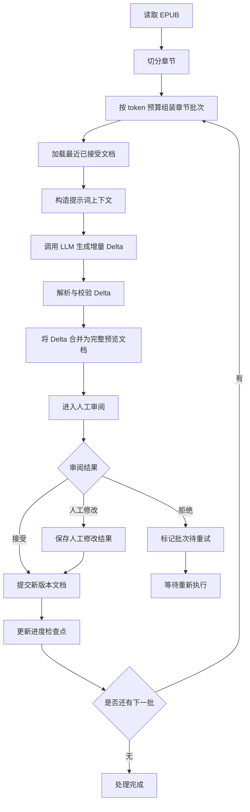
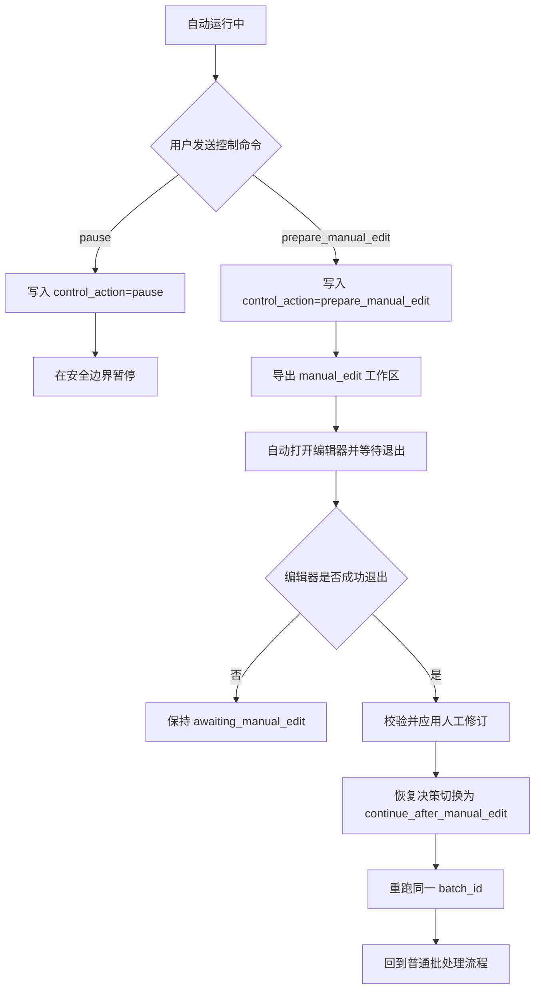

# EPUB 小说转 YAML 文档系统设计文档

## 1. 文档目标

本文档定义一个基于 Python 与 LangGraph 的批处理系统，用于将 EPUB 小说内容按章节分批转换为结构化 YAML 文档。

首版目标聚焦于两类输出：

- `actors`：角色总结文档
- `worldinfo`：世界设定文档

系统需要支持以下能力：

- 从 EPUB 中提取并标准化章节内容
- 按批次处理多个章节
- 在处理当前批次时携带上一次已接受的 YAML 文档，让 LLM 做增量更新
- 在每个批次处理后进入可选人工审阅
- 人工审阅支持接受、拒绝、人工修改三种结果
- 持久化处理进度与文档版本，便于断点恢复
- 支持运行中暂停、人工修订中断与恢复
- 提供 CLI 与 Textual CUI 两类控制入口

## 2. 背景与约束

### 2.1 现有处理方式

当前已有人工提示词模板，核心思路为：

1. 输入小说正文片段
2. 附带此前生成的场景、人物总结、设定信息
3. 让 LLM 输出更新后的 YAML
4. 输出内容要求完整、结构化、可供后续 AI Director 使用

现有提示词已体现以下重要约束：

- 增量更新而非每次全量重建
- 输出只包含发生变化的角色与设定
- 角色和设定条目内部必须完整输出，不能残缺
- 时间表述要使用稳定、可定位的视角
- 对不确定信息应尽量规避无意义占位值
- 原文可能由日文翻译而来，存在名字错配，需要一定修复能力

### 2.2 设计边界

当前设计边界如下：

- 输出文档类型固定为 `actors` 与 `worldinfo`
- 以后允许扩展更多文档类型，但当前不做通用插件系统的完整实现
- 人工审阅粒度为每批章节一次
- 人工修订中断采用协作式控制，不做进程级强杀
- 技术选型以 LangGraph 为主编排层，LangChain 用于模型调用、提示词模板与结构化输出封装
- 本地 CLI 与 Textual CUI 共存，Typer 负责命令入口，Textual 负责长期运行控制台

## 3. 设计目标

### 3.1 功能目标

- 将 EPUB 按章节切分为可处理单元
- 支持按配置的批次大小处理章节
- 将当前批次正文与上次已接受文档一并送入 LLM
- 生成新的 `actors.yaml` 与 `worldinfo.yaml` 增量候选结果
- 在候选结果生成后允许人工审阅
- 支持运行中请求 `pause`、`prepare_manual_edit`、`resume`
- 若当前批次尚未产出 preview，仍可导出人工修订基线文件
- 人工修订完成后先应用修订，再重跑同一批次编号
- 保存断点信息，支持从最近已提交批次继续处理

### 3.2 非功能目标

- 可追溯：每个批次的输入、输出、审阅结果可追踪
- 可恢复：中断后可继续执行，无需从头开始
- 可重试：被拒绝批次可重新生成
- 可维护：提示词、状态模型、存储层、控制层分离
- 可扩展：后续可增加新的 YAML 文档类型、更多审阅策略、服务化入口

## 4. 总体方案概览

系统分为七层：

1. 输入层：读取 EPUB 并切分章节
2. 预处理层：章节清洗、元数据标准化、批次组装
3. 编排层：由 LangGraph 控制单批状态流转
4. 应用服务层：负责恢复决策、控制边界、人工修订导出与恢复
5. LLM 层：使用 LangChain 封装提示词、模型调用与输出解析
6. 存储层：保存进度、审阅记录、批次产物、人工修订会话与当前正式 YAML 文档
7. 交互层：本地 CLI 与 Textual CUI

## 5. 核心流程

### 5.1 主处理流程



### 5.2 人工修订控制流



### 5.3 状态流转说明

每个批次有明确状态：

- `pending`：尚未处理
- `generated_delta`：LLM 已生成增量结果
- `merged_preview_ready`：系统已生成完整预览文档
- `review_required`：等待人工审阅
- `manual_edit_requested`：已请求人工修订
- `cancelled_for_manual_edit`：当前批次为人工修订而停止推进
- `awaiting_manual_edit_resume`：人工修订已准备或已应用，等待重跑
- `accepted`：审阅通过并提交
- `edited`：人工修改后提交
- `rejected`：审阅拒绝，等待重试
- `failed`：调用、解析或校验失败

运行状态额外包含：

- `initialized`
- `running`
- `paused`
- `review_required`
- `awaiting_manual_edit`
- `completed`
- `failed`

## 6. 推荐技术栈

### 6.1 语言与核心库

- Python 3.11+
- LangGraph：流程编排、状态流转
- LangChain：模型抽象、PromptTemplate、输出解析
- ebooklib 或其他 EPUB 解析库：读取 EPUB
- pydantic：状态模型、输出结构校验
- ruamel.yaml 或 PyYAML：YAML 读写
- typer：CLI 命令入口
- textual：长期运行终端控制台

### 6.2 技术选型理由

#### 为什么选择 LangGraph

LangGraph 适合单批生成、校验、合并、入队审阅这类显式状态机问题。

#### 为什么人工修订控制先放在服务层

当前重点是可恢复、可暂停、可人工修订中断，而不是把图引擎改造成长期挂起模型。因此保持工作流为“单批执行”，在应用服务层增加控制边界，风险更低。

#### 为什么引入 Textual

Textual 更适合：

- 长期运行终端界面
- 异步刷新运行状态
- 发送 pause / prepare manual edit / resume
- 同时展示状态、批次详情、控制区与日志区

## 7. 目录与版本策略

### 7.1 输出目录结构

```text
runs/
  <book_id>/
    source/
      original.epub
    extracted/
      chapters.jsonl
    current/
      actors.yaml
      worldinfo.yaml
    batches/
      0001/
        input.json
        prompt.txt
        raw_output.md
        delta.yaml
        merged_actors.preview.yaml
        merged_worldinfo.preview.yaml
        review.json
        record.json
    history/
      actors/
      worldinfo/
    manual_edit/
      active_session.json
      actors.editable.yaml
      worldinfo.editable.yaml
      note.txt
    state/
      run_state.json
      checkpoints.jsonl
      document_versions.jsonl
      review_queue.json
      review_history.jsonl
```

### 7.2 目录职责

- `current/`：当前正式版本
- `history/`：历史版本归档
- `batches/`：批次输入、Delta、preview、review、record
- `manual_edit/`：人工修订工作区与当前会话
- `state/`：运行态、恢复态、检查点、审阅队列

## 8. 数据模型设计

### 8.1 关键模型

当前实现包含以下扩展：

```python
class RunState(BaseModel):
    book_id: str
    source_file: str
    source_hash: str
    total_chapters: int
    next_chapter_index: int
    last_accepted_batch_id: str | None
    last_generated_batch_id: str | None
    pending_review_batch_id: str | None
    last_failed_batch_id: str | None
    last_failed_stage: str | None
    last_failure_reason: str | None
    last_failure_retryable: bool | None
    recommended_action: str | None
    last_recovery_action: str | None
    last_recovery_batch_id: str | None
    current_actors_version: int
    current_worldinfo_version: int
    control_action: str | None
    control_requested_at: datetime | None
    awaiting_manual_edit: bool
    manual_edit_batch_id: str | None
    manual_edit_workspace: str | None
    manual_edit_applied: bool
    resume_from_manual_edit: bool
    status: str
```

```python
class ManualEditSession(BaseModel):
    book_id: str
    batch_id: str
    chapter_start: int
    chapter_end: int
    workspace_dir: str
    editable_actors_path: str
    editable_worldinfo_path: str
    note_path: str | None
    source_current_actors_hash: str
    source_current_worldinfo_hash: str
    status: str
    created_at: datetime
    applied_at: datetime | None
    editor_command: str | None
    editor_exit_code: int | None
    last_error: str | None
```

```python
class BatchRecord(BaseModel):
    batch: ChapterBatch
    status: str
    validation_errors: list[str]
    review_decision: ReviewDecision | None
    retry_count: int
    last_failure: FailureInfo | None
    manual_edit_session: ManualEditSession | None
    manual_edit_requested_at: datetime | None
```

### 8.2 恢复决策优先级

当前恢复决策顺序为：

1. `manual_edit_applied -> continue_after_manual_edit`
2. `awaiting_manual_edit -> await_manual_edit`
3. `paused -> paused`
4. `pending_review -> resume_pending_review`
5. `retryable_failed -> retry_failed_batch`
6. `next batch -> continue_new_batch`
7. `completed`

## 9. 工作流设计

### 9.1 当前工作流边界

当前 [`run_batch_generation_workflow`](../src/epub2yaml/workflow/graph.py) 仍然保持单批模型，负责：

1. `load_run_state`
2. `prepare_batch`
3. `load_current_documents`
4. `build_filtered_context`
5. `build_prompt`
6. `invoke_llm`
7. `parse_delta_output`
8. `merge_delta_preview`
9. `validate_merged_preview`
10. `enqueue_review`
11. `handle_failure`

### 9.2 控制边界位置

当前控制语义放在 [`PipelineService.run_to_completion()`](../src/epub2yaml/app/services.py) 中处理，包括：

- `pause`
- `prepare_manual_edit`
- `resume`
- `continue_after_manual_edit`

后续若需要更细粒度中断，可继续把控制检查下沉到工作流阶段边界。

## 10. 人工审阅与人工修订

### 10.1 普通审阅

保留原有三种决策：

- `accept`
- `reject`
- `edit`

### 10.2 人工修订

新增独立的人工修订语义：

1. 请求 `prepare_manual_edit`
2. 服务层导出 `manual_edit/` 工作区
3. 系统自动打开编辑器并等待退出
4. 关闭后执行 YAML 校验
5. 校验通过则应用到 `current/`
6. 对同一 `batch_id` 重跑生成流程

### 10.3 编辑器启动策略

当前实现提供 `EditorLauncher` 抽象，按以下顺序解析编辑器：

1. `EPUB2YAML_EDITOR`
2. `VISUAL`
3. `EDITOR`
4. 平台默认回退命令

支持命令模板，例如：

- `code --wait {file}`
- `notepad {file}`
- `open -W -a TextEdit {file}`
- `nano {file}`

## 11. CLI 与 Textual CUI

### 11.1 CLI 命令

当前 CLI 已支持：

- `init-run`
- `generate-yaml`
- `process-next-batch`
- `resume-run`
- `pause-run`
- `prepare-manual-edit`
- `open-manual-edit-workspace`
- `apply-manual-edit`
- `continue-after-manual-edit`
- `retry-last-failed`
- `retry-batch`
- `review-batch`
- `show-status`
- `control-ui`

### 11.2 Textual CUI

当前提供最小版 Textual 控制台，负责：

- 展示状态概览
- 展示当前批次与恢复建议
- 发送 `Pause`
- 发送 `Prepare Manual Edit`
- 执行 `Resume`
- 重新打开人工修订工作区
- 输出控制命令日志

## 12. 当前实现进度

### 已完成

- 已扩展 [`RunState`](../src/epub2yaml/domain/models.py) 与 [`BatchRecord`](../src/epub2yaml/domain/models.py)
- 已新增 [`ManualEditSession`](../src/epub2yaml/domain/models.py)
- 已扩展 [`StateStore`](../src/epub2yaml/infra/state_store.py) 支持控制命令与人工修订会话持久化
- 已在 [`PipelineService`](../src/epub2yaml/app/services.py) 中实现：
  - `prepare_manual_edit`
  - `apply_manual_edit_session`
  - `continue_after_manual_edit`
  - `request_control_action`
  - `open_manual_edit_workspace`
- 已新增 [`EditorLauncher`](../src/epub2yaml/app/editor.py)
- 已新增 Textual 控制台模块 [`src/epub2yaml/app/control_ui.py`](../src/epub2yaml/app/control_ui.py)
- 已补充人工修订与暂停相关测试
- 已更新使用文档 [`docs/mvp-usage.md`](../docs/mvp-usage.md)

### 当前限制

- 工作流本身仍未实现图内长期挂起
- Textual 控制台为最小可用版本，布局与日志能力仍可继续增强
- 当前自动打开编辑器以单文件入口为主，未做多文件并排编辑编排
- Linux GUI/CLI 编辑器模式尚未做更完整的显式配置分支

## 13. 后续建议

1. 把控制检查下沉到工作流更多阶段边界
2. 为 Textual 增加更完整的批次详情与错误展示
3. 为编辑器启动策略补足更多跨平台测试
4. 增加人工修订失败回退与幂等恢复的更细测试
5. 视需要再考虑图内长期等待模型或服务化调度

