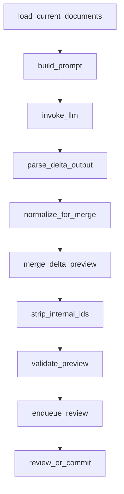

# 增量更新与结构化合并方案

## 1. 目标

在现有基于 Delta 的工作流基础上，进一步把输出粒度从整角色/整设定下沉到字段级与子树级，减少 LLM 每批重复输出的大段结构化内容，降低 token 消耗，同时保持当前链路已有的 merged preview、审阅、回滚能力。

本方案针对当前实现中的以下关键点展开：

- 现有提示词仍要求变更角色输出完整条目，见 [`DEFAULT_FORMAT_RULES`](../src/epub2yaml/llm/chains/document_update_chain.py:16)
- 当前深层合并只支持字典递归覆盖，数组仍是整字段替换，见 [`merge_document()`](../src/epub2yaml/domain/services.py:129)
- 当前工作流已经具备 Delta 解析与 merged preview 生成能力，见 [`_parse_delta_output()`](../src/epub2yaml/workflow/graph.py:335) 与 [`_merge_delta_preview()`](../src/epub2yaml/workflow/graph.py:371)

## 2. 已确认决策

### 2.1 范围

采用完整方案：

- LLM 输出细粒度 Delta
- 程序侧执行递归合并
- 保留 merged preview
- 保留人工审阅
- 保留回滚与失败恢复能力

### 2.2 Delta 粒度

采用细粒度 Delta：

- `actors` 与 `worldinfo` 都只输出发生变化的字段或子树
- 提示词必须明确允许输出部分字段，不再要求变更角色或设定输出完整条目
- 不再要求变更角色输出整角色完整条目
- 允许对象数组只输出变化元素，而不是整数组
- 这样可以直接适配增量更新目标，减少重复输出与 token 消耗

### 2.3 数组合并方向

数组采用对象级合并：

- 对象数组中的元素在程序内部动态补充临时 `id`
- 合并时根据 `id` 判断是替换已有元素还是新增元素
- 正式落盘前移除内部 `id`
- 审阅看到的 merged preview 也不应暴露内部 `id`

### 2.4 删除语义

允许 LLM 在 Delta 中输出 `null` 表达删除字段，但删除操作必须进入人工确认：

- 当某字段在 Delta 中被设置为 `null` 时，表示请求从当前文档删除该字段
- 删除语义适用于普通字段、对象中的子字段，以及整个数组字段或对象字段
- `null` 只作为更新指令存在，不能出现在最终落盘 YAML 与 merged preview 中
- 这条规则用于保证正式文档中不存在值为 `null` 的字段
- 任何检测到 `null` 删除语义的批次，都不能直接自动提交，必须进入人工审阅确认删除是否接受

## 3. 目标状态



核心思想：

1. LLM 只输出变化字段
2. 程序在内存中把现有文档和 Delta 都规范化为带内部 ID 的结构
3. 对对象数组按元素 ID 进行新增或替换
4. 合并完成后去掉内部 ID，再生成对外 preview 与最终 YAML
5. 若 Delta 某字段为 `null`，则在 merge 过程中直接删除该字段

## 4. 现状与问题

### 4.1 当前优点

当前系统已经具备以下基础：

- Delta YAML 解析能力，见 [`parse_delta_yaml()`](../src/epub2yaml/domain/services.py:87)
- 递归字典合并能力，见 [`merge_document()`](../src/epub2yaml/domain/services.py:129)
- preview 生成能力，见 [`_merge_delta_preview()`](../src/epub2yaml/workflow/graph.py:371)
- 批次审阅入队能力，见 [`_enqueue_review()`](../src/epub2yaml/workflow/graph.py:417)

### 4.2 当前限制

当前限制主要有三类：

1. 提示词限制过强
   - 当前规则要求变更角色输出完整条目
   - 这会让本来只改一两个字段的角色也重复输出大量不变字段

2. 数组语义过粗
   - 当前字典递归合并遇到数组会直接整体覆盖
   - 对 `personal_traits`、`tools_and_equipment`、`canon_timeline`、`other_dialogue_examples` 这类对象数组不友好

3. 缺少内部规范化层
   - 当前工作流直接把 Delta 与 current 文档合并
   - 没有一层专门处理对象数组元素识别、内部 ID 注入、去 ID 输出

## 5. 设计原则

### 5.1 输入输出分离

- LLM 输入不要求也不暴露内部 `id`
- LLM 输出不要求也不允许出现内部 `id`
- `id` 仅存在于程序内部 merge 过程

### 5.2 外部格式稳定

- `current/` 正式文档格式保持不变
- `merged_actors.preview.yaml` 与 `merged_worldinfo.preview.yaml` 对外也不新增 `id`
- 现有审阅者不需要理解内部 ID 机制
- 最终文档与 preview 中都不允许保留值为 `null` 的字段

### 5.3 合并优先稳定而不是智能猜测

- 能明确识别对象数组元素时，才做按元素 merge
- 无法稳定识别时，走清晰的兜底策略，而不是启发式乱匹配

### 5.4 失败显式化

- 元素匹配歧义
- 同一数组内 ID 冲突
- 数组项类型不一致
- Delta 结构非法

上述情况不静默吞掉，应进入失败或审阅门控。

## 6. 数据合并语义

### 6.1 标量

- Delta 中出现的标量直接覆盖旧值
- 若字段不存在则新增
- 若 Delta 某字段值为 `null`，则删除当前字段，而不是把字段值写成 `null`

### 6.2 映射

- 若 current 与 delta 都是映射，则递归合并
- 只更新变化子树
- 若某个子键在 Delta 中被显式设置为 `null`，则从当前映射中删除该子键

### 6.3 数组总规则

数组分为三类：

1. 对象数组
2. 标量数组
3. 混合或非法数组

#### 6.3.1 对象数组

对象数组指数组中每个元素均为映射，例如：

```yaml
personal_traits:
  - trait_name: 冷静
    scope: 战斗时
```

合并规则：

- 进入内部 ID 规范化流程
- 为 current 数组与 delta 数组中的每个对象项生成内部 `id`
- 若 delta 元素的 `id` 在 current 中存在，则执行元素级替换或递归合并
- 若不存在，则视为新增元素并追加到数组
- 输出前移除内部 `id`
- 若对象数组字段本身在 Delta 中为 `null`，则删除整个数组字段

#### 6.3.2 标量数组

例如：

```yaml
likes:
  - 红茶
  - 甜点
```

首版建议继续整字段替换，不做元素级增量合并。

原因：

- 标量数组缺少稳定主键
- 仅靠值做 merge 很容易产生误判
- 这类字段通常长度可控，整字段替换的 token 收益损失有限
- 如果该字段在 Delta 中是 `null`，则直接删除该数组字段

#### 6.3.3 混合数组或非法数组

例如同一数组同时包含标量与对象，或 Delta 与 current 在同一路径类型不一致。

规则：

- 默认判定为非法或不可安全 merge
- 返回校验错误，阻止自动提交

## 7. 内部 ID 机制设计

## 7.1 为什么不能直接靠完整内容做哈希

如果对整个对象项做哈希：

- 只要内容变了，哈希就变
- 程序会把“更新已有元素”误判为“新增新元素”

因此内部 ID 不能直接依赖完整对象内容。

## 7.2 推荐策略

首版采用 路径级匹配规则 + 内部 ID 注入 的混合设计。

具体做法：

1. 为可增量合并的对象数组路径配置匹配字段规则
2. 程序对 current 数组按匹配字段生成稳定内部 ID
3. 程序对 delta 数组按相同规则生成待匹配 ID
4. 根据 ID 决定替换或新增
5. 合并完成后统一去除内部 `id`

### 7.3 匹配规则来源

建议新增一份数组匹配规则注册表，按 YAML 路径声明对象数组的主键字段。

示例概念：

- `actors.*.personality_core.personal_traits` 使用 `trait_name + scope`
- `actors.*.personality_core.internal_conflicts` 使用 `conflict_name + scope`
- `actors.*.skills_and_vulnerabilities.talents_and_skills` 使用 `category + skill_name`
- `actors.*.skills_and_vulnerabilities.special_abilities` 使用 `name`
- `actors.*.tools_and_equipment` 使用 `item_name`
- `actors.*.canon_timeline` 使用 `event + timeframe`
- `actors.*.dialogue_and_quotes.other_dialogue_examples` 使用 `cue + response`
- `actors.*.sex_history` 使用 `partner + behavior + result`
- `actors.*.pregnancy` 使用 `weeks + father + race + bloodline`
- `actors.*.offspring` 使用 `name + dob + father`
- `worldinfo.*.<custom_object_array_path>` 后续按实际结构补充

### 7.4 内部 ID 生成形式

建议内部生成：

- `id = sha256(normalized_path + normalized_key_fields)`

其中：

- `normalized_path` 用于隔离不同数组路径
- `normalized_key_fields` 用于表达该元素的身份而不是完整内容

### 7.5 匹配规则的兜底策略

若某数组路径未配置匹配规则：

- 若是对象数组，默认不做局部元素 merge
- 返回明确错误，提示该路径缺少匹配规则
- 不建议自动退化为完整内容哈希匹配

原因：这样更可控，也更容易逐步扩展。

### 7.6 同一数组中的冲突

如果出现以下情况，应报错：

- current 数组中两个元素生成相同 `id`
- delta 数组中两个元素生成相同 `id`
- 生成 `id` 所需关键字段缺失
- 关键字段为空且无法形成稳定标识

## 8. 对象数组的元素级合并语义

当 delta 数组中的某项匹配到 current 数组已有 `id` 时：

- 推荐对该元素继续执行递归 merge，而不是整元素覆盖

原因：

- 用户已经明确希望 Delta 只输出变化字段
- 如果整元素覆盖，会要求 LLM 对单个对象数组元素也输出完整结构，token 收益又会被吃掉

因此对象数组内部的单项合并规则应为：

1. 先通过内部 `id` 选中目标元素
2. 再对该元素执行与普通映射相同的递归 merge
3. 若某子字段还是数组，则继续按本方案递归处理
4. 若某子字段值为 `null`，则删除该对象元素中的对应字段

## 9. 建议的纯函数边界

建议把当前 [`merge_document()`](../src/epub2yaml/domain/services.py:129) 所在领域服务扩展为一组可单测的纯函数。

### 9.1 建议新增能力

- `build_array_match_registry` 或常量注册表
- `inject_internal_ids_for_document`
- `inject_internal_ids_for_delta`
- `merge_mapping_value`
- `merge_sequence_value`
- `strip_internal_ids`
- `prune_null_fields`
- `merge_delta_package_with_internal_ids`

### 9.2 建议边界职责

#### 规范化阶段

输入：

- current 文档
- delta 文档
- 路径匹配规则

输出：

- 带内部 `id` 的 current 结构
- 带内部 `id` 的 delta 结构

#### 合并阶段

输入：

- 带内部 `id` 的结构

输出：

- 带内部 `id` 的 merged 结构

#### 输出阶段

输入：

- 带内部 `id` 的 merged 结构

输出：

- 去 ID 且移除所有 `null` 字段后的最终文档结构

## 10. 工作流改造点

### 10.1 提示词层

需要修改 [`DocumentUpdateChain`](../src/epub2yaml/llm/chains/document_update_chain.py:243) 的输出约束。

当前规则中最需要调整的是 [`DEFAULT_FORMAT_RULES`](../src/epub2yaml/llm/chains/document_update_chain.py:16) 第 4 条。

建议改为：

- 角色与设定只输出变化字段或变化子树
- 对象数组只输出变化元素
- 不输出程序内部使用的 `id`
- 若修改对象数组元素，需保留该元素用于识别的关键字段
- 若希望删除字段，允许输出 `null` 表达删除意图
- 最终落盘文档不能包含 `null` 值，`null` 只在 Delta merge 过程中生效

这意味着提示词要新增一类约束：

- 对支持对象数组局部更新的路径，模型必须保留元素识别字段
- 例如更新 `personal_traits` 中某一项时，至少保留 `trait_name` 与 `scope`

### 10.2 解析层

[`parse_delta_yaml()`](../src/epub2yaml/domain/services.py:87) 仍可复用现有根结构校验，但需要增加：

- 更细的对象数组项结构校验
- 对需要 key 字段的数组项做必填校验
- 对 `null` 删除语义做合法性校验，确保只删除字段而不是产出带 `null` 的正式文档

### 10.3 merge preview 层

[`_merge_delta_preview()`](../src/epub2yaml/workflow/graph.py:371) 需要改造为：

1. 读取 current 文档
2. 对 current 与 delta 执行内部 ID 规范化
3. 调用新的递归 merge
4. 清理 `null` 删除标记并去掉内部 `id`
5. 再调用 [`dump_yaml_document()`](../src/epub2yaml/domain/services.py:149) 生成 preview

### 10.4 审阅层

[`_enqueue_review()`](../src/epub2yaml/workflow/graph.py:417) 产物层保持兼容，但建议新增辅助产物：

- `merge_debug.json`
- `array_match_report.json`

用于记录：

- 哪些数组路径触发了对象级 merge
- 哪些元素匹配为 replace
- 哪些元素被视为 append
- 哪些字段因 `null` 被删除
- 哪些路径因为缺少规则或冲突而失败

注意：这些调试产物可以包含内部 ID，但不应进入正式 YAML。

## 11. 校验与失败策略

### 11.1 必须新增的校验

1. 对象数组项必须是映射
2. 需要元素级 merge 的数组路径必须存在匹配规则
3. 生成内部 `id` 所需字段必须存在
4. 同一数组内不得产生重复 `id`
5. current 与 delta 在同一路径上的类型不兼容时应报错
6. 去 ID 后的 preview 仍需通过现有 YAML 映射校验
7. preview 与最终文档中不得残留任何 `null` 字段

### 11.2 推荐动作

建议错误分层：

- 结构非法或规则缺失：直接失败，`suggested_action = retry_batch`
- 只是结果内容可疑但结构合法：继续进入审阅

## 12. 测试规划

### 12.1 领域服务测试

在 [`tests/test_domain_services.py`](../tests/test_domain_services.py) 补充至少以下场景：

1. 字典递归 merge 仍保持兼容
2. 对象数组按匹配字段命中已有元素后做递归更新
3. 对象数组未命中时追加新元素
4. 对象数组中存在两个相同主键元素时抛错
5. 关键识别字段缺失时抛错
6. 标量数组继续整字段替换
7. 去 ID 后正式输出不残留内部字段
8. Delta 某字段为 `null` 时，对应字段会被删除且最终文档不出现 `null`

### 12.2 提示词工作流测试

在 [`tests/test_llm_workflow.py`](../tests/test_llm_workflow.py) 增加：

- prompt 中明确要求只输出变化字段
- prompt 中明确要求对象数组保留识别字段但不输出内部 `id`
- prompt 中明确允许用 `null` 删除字段，但最终文档不得保留 `null`

### 12.3 端到端流程测试

在 [`tests/test_mvp_pipeline.py`](../tests/test_mvp_pipeline.py) 增加：

- 给定 current 文档与局部数组 Delta，能得到正确 merged preview
- preview 中不出现内部 `id`
- 删除字段后 preview 中不出现 `null`
- 批次产物中可选调试文件存在且内容合理
- 审阅与后续提交流程不因新 merge 机制破坏

## 13. 实施顺序

- [ ] 在领域层定义对象数组匹配规则注册表与内部 ID 生成规则
- [ ] 扩展 [`src/epub2yaml/domain/services.py`](../src/epub2yaml/domain/services.py) 的 merge 设计，拆出对象数组 merge、`null` 删除处理与去 ID 纯函数
- [ ] 调整 [`DEFAULT_FORMAT_RULES`](../src/epub2yaml/llm/chains/document_update_chain.py:16) 与相关提示词模板，改为细粒度 Delta 约束并允许 `null` 删除字段
- [ ] 改造 [`_merge_delta_preview()`](../src/epub2yaml/workflow/graph.py:371)，接入规范化 merge、删除处理与去 ID 输出
- [ ] 为数组匹配冲突、缺少规则、关键字段缺失、非法 `null` 用法补充校验与失败信息
- [ ] 补齐 [`tests/test_domain_services.py`](../tests/test_domain_services.py)、[`tests/test_llm_workflow.py`](../tests/test_llm_workflow.py)、[`tests/test_mvp_pipeline.py`](../tests/test_mvp_pipeline.py)
- [ ] 视需要再决定是否把调试级 `array_match_report.json` 固化为批次标准产物

## 14. 推荐的首版收敛边界

为了控制实现复杂度，首版建议明确限制：

1. 只对对象数组启用按元素 merge
2. 只对已注册匹配规则的数组路径启用局部元素更新
3. 标量数组仍整字段替换
4. 支持字段级删除语义，删除方式为 Delta 输出 `null`
5. 暂不支持数组元素删除语义的独立表达
6. 不支持数组元素重排语义的专门表达
7. preview 与正式落盘都去除内部 `id`，并移除所有 `null` 字段

这样可以先拿到主要 token 收益，同时避免因为“全自动智能数组 merge”把系统复杂度拉得过高。

## 15. 预期收益

### 15.1 收益

- 大幅减少变更角色的重复字段输出
- 对大型对象数组可只输出变化元素
- 支持通过 `null` 显式删除过时字段，避免正式文档残留无效空字段
- 保持现有 preview、审阅、回滚链路不变
- 为后续更细粒度的结构化更新打下基础

### 15.2 代价

- 需要维护数组路径到匹配字段的规则表
- merge 逻辑明显复杂于当前 [`merge_document()`](../src/epub2yaml/domain/services.py:129)
- 需要补充较多测试，保证对象数组 merge 不误判

## 16. 结论

本方案可以在不改变正式 YAML 对外格式的前提下，把当前系统从“字典递归合并 + 数组整替换”升级为“字段级 Delta + 对象数组按元素 ID 合并”。

其中最关键的实现前提不是内部 `id` 本身，而是：

- 对对象数组路径建立稳定的匹配规则
- 让 LLM 在局部元素更新时保留最小识别字段
- 允许 LLM 用 `null` 显式表达字段删除，但保证最终文档不保留 `null`
- 把 `id` 严格限制在程序内部规范化与 merge 过程

只要这几条落稳，细粒度 Delta 才能真正减少 token，同时不破坏现有审阅与回滚能力。

