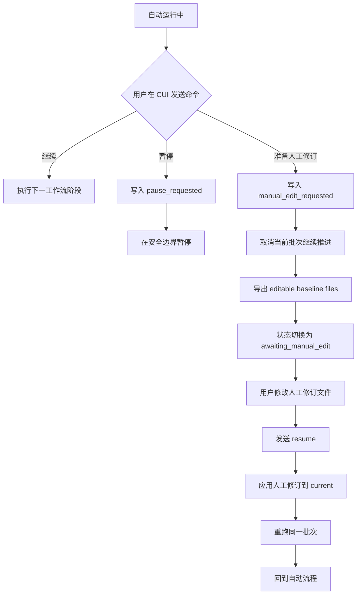
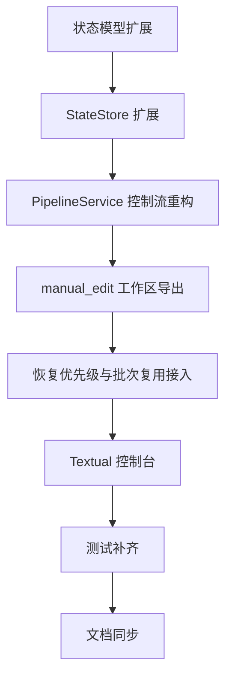

# 人工修订中断与 Textual CUI 重构计划

## 1. 背景

当前自动流程的核心问题不是单个 YAML 文件该改哪里，而是自动运行链路没有为运行中的人工干预提供正式入口。

现状要点：

- 自动主链路由 [`PipelineService.generate_yaml()`](../src/epub2yaml/app/services.py:182) 和 [`PipelineService.run_to_completion()`](../src/epub2yaml/app/services.py:101) 驱动
- 批次工作流由 [`run_batch_generation_workflow()`](../src/epub2yaml/workflow/graph.py:137) 执行
- preview 只有在 [`_enqueue_review()`](../src/epub2yaml/workflow/graph.py:499) 阶段才会落盘
- 当前 CLI 入口基于 [`typer.Typer()`](../src/epub2yaml/app/cli.py:14)，更适合一次性命令，不适合运行中持续收控制指令

这导致以下痛点：

1. 运行中发现数据异常时，当前批次可能只有 [`input.json`](../src/epub2yaml/infra/state_store.py:52) 已写出，尚无 preview 可修改
2. 自动流程会持续推进到下一批，人工无法优雅插入修订动作
3. 直接修改 [`current/actors.yaml`](../src/epub2yaml/infra/yaml_store.py) 与 [`current/worldinfo.yaml`](../src/epub2yaml/infra/yaml_store.py) 只能影响后续生成基线，不能表达正式的人工修订意图
4. 当前状态模型无法表达 等待人工修订 待应用修订 与 运行时控制命令

## 2. 本次重构目标

本次重构的目标是引入一条正式的 人工修订中断 流程，并提供一个可在运行中发送控制命令的 CUI。

目标能力：

1. 运行中可以通过 CUI 发送 暂停当前批次 与 准备人工修订 命令
2. 系统采用协作式取消，不做进程级强杀
3. 若当前批次尚未产出 preview，系统可以导出可编辑基线文件供人工修订
4. 人工修订完成后，恢复流程会先应用修订，再重跑同一批次，而不是直接进入下一批
5. 自动推进逻辑会尊重新的控制状态，不再无条件跑到底
6. 修改模式会自动打开外部编辑器，并在编辑器关闭后再进入下一步，交互语义类似 Git 提交信息编辑
7. Textual 成为主交互 CUI，Typer 继续保留为普通命令入口

## 3. 核心设计结论

### 3.1 主交互方案

采用 **Textual** 作为主 CUI 方案。

原因：

- 适合长期运行的终端界面
- 支持键盘事件与异步消息
- 能同时显示运行状态 批次信息 日志与控制区
- 比单次命令式 CLI 更适合 运行中发控制命令 的需求

### 3.2 中断语义

采用 **协作式暂停取消**，不做进程级强杀。

含义：

- CUI 发送控制命令后，将命令持久化到状态层
- worker 在关键边界检查控制状态并执行暂停或转入人工修订
- 不要求从外部立即终止 Python 进程

### 3.3 人工修订命令语义

需要新增一个专门的 准备人工修订 命令，而不是复用普通 [`review_batch()`](../src/epub2yaml/app/services.py:208) 语义。

该命令职责：

1. 标记当前批次为待人工修订中断
2. 阻止自动推进进入下一批
3. 导出当前正式文档为可编辑基线文件
4. 持久化本次修订任务元信息
5. 等待用户修改完成后再恢复

### 3.4 自动打开编辑器并等待退出

人工修订模式需要采用 类 Git 的编辑器交互：

1. 系统准备好 [`runs/<book_id>/manual_edit/`](../runs/) 工作区后，自动打开编辑器
2. 前台流程等待编辑器进程退出，而不是只提示文件路径
3. 编辑器关闭后，系统再进入 校验修订内容 应用修订 恢复批次 的后续步骤
4. 若用户取消或编辑器异常退出，则保留人工修订会话，状态仍停留在 `awaiting_manual_edit`

该能力应视为 人工修订主路径 的一部分，而不是可选增强项。

## 4. 建议的新状态流



## 5. 架构改造方案

### 5.1 分层职责调整

#### 交互层

新增 Textual 控制台应用，负责：

- 展示当前 run 状态
- 展示当前 batch 章节范围与状态
- 展示最近错误与推荐动作
- 发送 pause prepare-manual-edit resume 等控制命令

Typer 保留：

- 初始化运行
- 非交互调试命令
- 兼容脚本式调用
- 启动 CUI 的入口命令

#### 应用服务层

[`PipelineService`](../src/epub2yaml/app/services.py:20) 需要从 一次跑到底 的流程控制，重构为 可被控制状态中断 的编排器。

重点改造点：

- [`PipelineService.run_to_completion()`](../src/epub2yaml/app/services.py:101)
- [`PipelineService.resume_run()`](../src/epub2yaml/app/services.py:229)
- [`PipelineService.get_recovery_decision()`](../src/epub2yaml/app/services.py:440)
- 新增 prepare_manual_edit apply_manual_edit resume_after_manual_edit 等接口

#### 工作流层

[`run_batch_generation_workflow()`](../src/epub2yaml/workflow/graph.py:137) 不必立刻改成长期挂起图，但要允许在阶段边界被上层控制打断。

建议在以下阶段边界检查控制状态：

1. [`_prepare_batch()`](../src/epub2yaml/workflow/graph.py:194) 后
2. [`_load_current_documents()`](../src/epub2yaml/workflow/graph.py:251) 后
3. [`_build_prompt()`](../src/epub2yaml/workflow/graph.py:314) 后
4. [`_invoke_llm()`](../src/epub2yaml/workflow/graph.py:352) 后
5. [`_parse_delta_output()`](../src/epub2yaml/workflow/graph.py:403) 后
6. [`_merge_delta_preview()`](../src/epub2yaml/workflow/graph.py:439) 后
7. [`_enqueue_review()`](../src/epub2yaml/workflow/graph.py:499) 前后

#### 状态与存储层

[`RunState`](../src/epub2yaml/domain/models.py:66) 与 [`BatchRecord`](../src/epub2yaml/domain/models.py:95) 需要扩展，以表达控制命令与人工修订任务。

[`StateStore`](../src/epub2yaml/infra/state_store.py:12) 需要新增读写接口，用于持久化：

- 当前控制请求
- 当前人工修订任务
- 导出文件路径
- 修订是否已应用
- 修订所对应的批次号

## 6. 数据模型改造建议

### 6.1 运行状态扩展

建议在 [`RunState`](../src/epub2yaml/domain/models.py:66) 中新增字段：

- `control_action`
- `control_requested_at`
- `awaiting_manual_edit`
- `manual_edit_batch_id`
- `manual_edit_workspace`
- `manual_edit_applied`
- `resume_from_manual_edit`

用途：

- 区分 普通运行 暂停请求 等待人工修订 恢复修订后运行
- 为 [`PipelineService.get_recovery_decision()`](../src/epub2yaml/app/services.py:440) 增加更高优先级分支

### 6.2 批次状态扩展

建议在 [`BatchStatus`](../src/epub2yaml/domain/enums.py:10) 新增语义状态：

- `manual_edit_requested`
- `cancelled_for_manual_edit`
- `awaiting_manual_edit_resume`

用途：

- 明确当前批次不是 failed，也不是普通 review_required
- 支持恢复时识别这是同批次重跑，而非新批次推进

### 6.3 运行状态枚举扩展

建议在 [`RunStatus`](../src/epub2yaml/domain/enums.py:21) 新增：

- `paused`
- `awaiting_manual_edit`

### 6.4 人工修订元数据模型

建议新增独立模型，例如 `ManualEditSession`，放在 [`src/epub2yaml/domain/models.py`](../src/epub2yaml/domain/models.py) 中。

建议字段：

- `book_id`
- `batch_id`
- `chapter_start`
- `chapter_end`
- `workspace_dir`
- `editable_actors_path`
- `editable_worldinfo_path`
- `source_current_actors_hash`
- `source_current_worldinfo_hash`
- `status`
- `created_at`
- `applied_at`

## 7. 文件与目录设计

### 7.1 新增人工修订工作区

建议在 [`runs/`](../runs/) 下新增目录结构：

```text
runs/<book_id>/manual_edit/
  active_session.json
  actors.editable.yaml
  worldinfo.editable.yaml
  note.txt
```

语义：

- `actors.editable.yaml` 与 `worldinfo.editable.yaml` 是人工可编辑基线
- `active_session.json` 保存会话元信息
- `note.txt` 保存当前批次信息与恢复提示

### 7.2 与现有 current history batches 的关系

- [`current/`](../runs/) 仍是正式版本
- [`history/`](../runs/) 仍只保存已提交历史
- [`batches/`](../runs/) 仍保存批次输入 中间产物 preview 审阅记录
- 新增 [`manual_edit/`](../runs/) 专门承载运行中人工修订工作区

这样可以避免直接把待修订内容混入正式 `current` 或尚未形成的 `batches/<id>/merged_*.preview.yaml`。

## 8. 控制通道设计

### 8.1 控制命令集合

建议最小控制命令集：

- `pause`
- `prepare_manual_edit`
- `resume`
- `show_status`
- `open_manual_edit_workspace`

### 8.2 控制命令持久化

建议把控制命令写入状态文件，而不是只保存在 Textual 内存里。

原因：

- worker 与 UI 解耦
- UI 重启后仍能恢复状态
- 便于测试与排障

### 8.3 安全边界

worker 只在安全边界消费控制命令，不在半写文件时中断。

安全边界最小原则：

- 不在正式写 [`current/`](../runs/) 中途切换
- 不在单个 artifact 写入中途切换
- 在阶段完成后检查控制状态

### 8.4 自动打开编辑器与平台差异

人工修订模式需要补上 自动打开编辑器 并等待退出 的统一策略，交互语义参考 Git 编辑提交信息：

1. 用户触发 `prepare_manual_edit`
2. 系统准备 [`runs/<book_id>/manual_edit/`](../runs/) 工作区
3. 系统自动启动外部编辑器
4. 当前流程阻塞等待编辑器退出
5. 编辑器关闭后再继续 校验修订内容 应用修订 恢复批次

建议增加统一的 EditorLauncher 抽象，负责：

- 解析编辑器来源
- 渲染待编辑文件路径
- 以阻塞方式启动编辑器
- 返回退出码与异常信息
- 为 Textual 与 Typer 复用同一套逻辑

建议编辑器解析优先级：

1. `EPUB2YAML_EDITOR`
2. `VISUAL`
3. `EDITOR`
4. 平台默认回退策略

建议支持完整命令模板，而不只是单个可执行文件名，例如：

- `code --wait {file}`
- `notepad {file}`
- `nvim {file}`
- `subl -w {file}`

平台差异注意事项：

#### Windows

- 优先执行用户显式配置的 [`EPUB2YAML_EDITOR`](../.env)
- VS Code 建议使用 `code --wait {file}`
- 系统记事本可使用 `notepad {file}` 并等待进程退出
- 不应依赖普通 `start`，否则通常会立即返回而不等待

#### macOS

- 图形应用建议使用 `open -W -a <AppName> <file>`
- 若用户提供终端编辑器命令，则直接执行该命令
- 普通 `open` 默认不等待，必须显式使用 `-W`

#### Linux

Linux 需要明确区分两种使用形态，并把选择权交给用户：

- 桌面 图形 形式
- CLI 终端 形式

建议策略：

1. 若用户显式配置 [`EPUB2YAML_EDITOR`](../.env)，则完全尊重用户指定命令
2. 若未显式配置，则优先根据当前环境判断是否提供 Linux 图形模式 与 CLI 模式 的可选项
3. 图形模式要求使用 具备等待语义 的 GUI 编辑器命令
4. CLI 模式要求使用 终端内可阻塞的编辑器命令

建议在 Textual 或 CLI 入口中，把 Linux 的编辑器模式显式建模为可选配置，例如：

- `editor_mode=gui`
- `editor_mode=cli`
- `editor_mode=auto`

语义建议：

- `gui`：优先使用 GUI 编辑器命令，并要求其具备等待退出语义
- `cli`：优先使用 `nvim` `vim` `nano` 等终端编辑器
- `auto`：若检测到桌面会话且存在可等待的 GUI 编辑器配置，则走 GUI；否则回退到 CLI

注意事项：

- 图形编辑器必须要求提供具备等待语义的命令参数
- 终端编辑器可直接阻塞等待
- 不建议把 `xdg-open` 作为主路径，因为通常无法可靠等待退出
- 不应擅自替用户在 Linux 上固定选 GUI 或 CLI，而应允许显式选择

失败回退规则：

1. 若无法自动打开编辑器，明确输出待编辑文件路径
2. 保留人工修订会话与工作区
3. 运行状态继续保持在 `awaiting_manual_edit`
4. 允许用户修正编辑器配置后再次执行 `resume` 或 `open_manual_edit_workspace`
5. 若 Linux 处于 `auto` 模式下 GUI 启动失败，可提示用户切换到 `cli` 模式重试，而不是直接判定人工修订失败

## 9. 服务层重构方案

### 9.1 需要拆分的现有职责

当前 [`PipelineService.run_to_completion()`](../src/epub2yaml/app/services.py:101) 同时承担：

- 自动决策
- 调用工作流
- 自动提交
- 推进到下一批

建议拆为：

1. `run_until_control_boundary`
2. `handle_recovery_decision`
3. `prepare_manual_edit`
4. `apply_manual_edit_session`
5. `continue_after_manual_edit`

### 9.2 恢复优先级调整

建议新的恢复优先级：

1. 待应用人工修订
2. 等待人工修订完成
3. 普通待审阅批次
4. 可重试失败批次
5. 新批次
6. completed

原因：

- 避免人工修订工作区被后续自动批次覆盖
- 保证同一批次编号语义连续
- 避免 `last_accepted_batch_id` 仍停在上一个批次时误进入新批次推进

### 9.3 自动提交行为调整

当前 [`PipelineService.run_to_completion()`](../src/epub2yaml/app/services.py:136) 和 [`PipelineService.run_to_completion()`](../src/epub2yaml/app/services.py:147) 会自动提交并继续下一批。

建议重构后改为：

- 默认在 review 或控制边界可停
- 自动提交只在明确无人工干预请求时继续
- 一旦存在 `manual_edit_requested`，立即停止后续自动推进

## 10. 工作流接入策略

### 10.1 最小改动原则

不把 LangGraph 立即重构成图内长期等待模型，而是保留当前单批执行模型，在应用服务层增加控制边界。

原因：

- 当前 [`build_pipeline_graph()`](../src/epub2yaml/workflow/graph.py:64) 已稳定服务于单批生成
- 需求重点是人工修订中断，而不是图引擎长期驻留
- 先从服务层控制最小侵入切入，风险更低

### 10.2 人工修订时的批次处理规则

如果用户在当前批次尚未产出 preview 前请求人工修订：

1. 不要求当前批次先生成 preview
2. 将该批次标记为 `cancelled_for_manual_edit`
3. 导出 editable baseline files
4. 恢复后重新使用同一 `batch_id` 进入 [`_prepare_batch()`](../src/epub2yaml/workflow/graph.py:194) 的已有批次复用路径

这与当前已有的已有批次复用逻辑一致，见 [`_prepare_batch()`](../src/epub2yaml/workflow/graph.py:197)。

## 11. Textual CUI 设计建议

### 11.1 界面区域

建议最小布局：

1. 运行概览区
   - `book_id`
   - `run_status`
   - `recommended_action`
   - 当前批次号
2. 批次详情区
   - 章节范围
   - 当前阶段
   - 最近错误
3. 控制区
   - Pause
   - Prepare Manual Edit
   - Resume
4. 日志区
   - 最近 checkpoint
   - 控制命令回显

### 11.2 事件模型

Textual 界面只发送命令，不直接操作业务文件。

推荐模式：

- UI 触发 action
- action 调用应用服务
- 应用服务写入控制状态
- worker 消费状态并推进

### 11.3 与 Typer 的关系

建议新增一个 Typer 命令，例如 `control-ui`，用于启动 Textual CUI。

普通子命令继续保留在 [`src/epub2yaml/app/cli.py`](../src/epub2yaml/app/cli.py:14)。

## 12. 测试策略

### 12.1 服务层测试

优先补测：

- 运行中请求 `prepare_manual_edit` 后不会进入下一批
- 未产出 preview 的批次也能导出 editable baseline files
- 人工修订应用后会重跑同一批次号
- 待人工修订状态在恢复优先级中高于 review 与 retry
- 人工修订应用失败时不会污染正式 [`current/`](../runs/)

建议补测文件：

- [`tests/test_app_services.py`](../tests/test_app_services.py)
- [`tests/test_mvp_pipeline.py`](../tests/test_mvp_pipeline.py)

### 12.2 状态层测试

需要覆盖：

- 控制命令落盘与清理
- `ManualEditSession` 落盘与读取
- 幂等 resume
- 重复 prepare_manual_edit 的冲突保护

### 12.3 工作流测试

需要覆盖：

- 批次复用路径仍可工作
- 人工修订后重跑同一批时不会错误创建下一个新批次
- preview 已存在与 preview 尚不存在两种分支都能正确恢复

## 13. 分阶段实施清单

### 阶段 A：定义状态模型与持久化

目标：让系统能表达 暂停 控制命令 人工修订会话。

任务：

1. 扩展 [`BatchStatus`](../src/epub2yaml/domain/enums.py:10) 与 [`RunStatus`](../src/epub2yaml/domain/enums.py:21)
2. 扩展 [`RunState`](../src/epub2yaml/domain/models.py:66)
3. 新增 `ManualEditSession` 模型到 [`src/epub2yaml/domain/models.py`](../src/epub2yaml/domain/models.py)
4. 为 [`StateStore`](../src/epub2yaml/infra/state_store.py:12) 增加控制命令与人工修订会话的读写接口

完成标志：

- 单看状态文件即可判断当前是否正在等待人工修订与下一步动作

### 阶段 B：重构应用服务控制逻辑

目标：停止无条件跑到底，让服务层能够在控制边界停下。

任务：

1. 拆分 [`PipelineService.run_to_completion()`](../src/epub2yaml/app/services.py:101)
2. 新增 `prepare_manual_edit`
3. 新增 `apply_manual_edit_session`
4. 调整 [`PipelineService.get_recovery_decision()`](../src/epub2yaml/app/services.py:440) 的优先级
5. 调整 [`PipelineService.resume_run()`](../src/epub2yaml/app/services.py:229) 以支持人工修订恢复路径

完成标志：

- 存在明确的人工修订暂停与恢复服务接口

### 阶段 C：接入批次复用与文件导出

目标：让当前批次即使没有 preview，也能进入人工修订流程。

任务：

1. 新增 `manual_edit/` 工作区导出逻辑
2. 导出可编辑基线文件与说明文件
3. 将当前批次标记为 `cancelled_for_manual_edit`
4. 恢复时复用原 `batch_id` 继续生成

完成标志：

- 当前批次只有 [`input.json`](../src/epub2yaml/infra/state_store.py:52) 时，也能正式转入人工修订流程

### 阶段 D：引入 Textual 控制台

目标：提供运行中发送控制命令的正式 CUI。

任务：

1. 新增 Textual 应用模块
2. 提供运行概览 批次详情 控制按钮 日志面板
3. 接入 pause prepare_manual_edit resume
4. 接入 自动打开编辑器 与 等待编辑器退出 后继续的控制流
5. 在 [`src/epub2yaml/app/cli.py`](../src/epub2yaml/app/cli.py) 暴露启动命令

完成标志：

- 用户无需手工编辑状态文件即可在运行中请求人工修订
- 进入修改模式后会自动打开编辑器并在关闭后再进入下一步

### 阶段 E：补齐测试与文档

目标：确保重构后控制流与恢复流可验证且可维护。

任务：

1. 补充服务层测试
2. 补充状态层测试
3. 补充工作流回归测试
4. 补充跨平台编辑器解析与等待语义测试
5. 更新 [`docs/mvp-usage.md`](../docs/mvp-usage.md)
6. 更新 [`plans/epub-to-yaml-design.md`](./epub-to-yaml-design.md)

完成标志：

- 文档与实现一致
- 关键人工修订路径有自动化覆盖
- 编辑器自动打开与等待退出语义具备回归保护

## 14. 不包含范围

本次重构明确不包含：

- 进程级强制终止
- Web UI
- 多书并发调度
- 数据库存储迁移
- 图内长期挂起等待节点
- 实时监听外部编辑器保存事件并做热更新

## 15. 实施顺序建议



## 16. 供实现模式直接执行的待办清单

- [ ] 扩展 [`src/epub2yaml/domain/enums.py`](../src/epub2yaml/domain/enums.py) 增加人工修订相关状态
- [ ] 扩展 [`src/epub2yaml/domain/models.py`](../src/epub2yaml/domain/models.py) 增加控制字段与 `ManualEditSession`
- [ ] 为 [`src/epub2yaml/infra/state_store.py`](../src/epub2yaml/infra/state_store.py) 增加控制命令与人工修订会话读写接口
- [ ] 重构 [`PipelineService.run_to_completion()`](../src/epub2yaml/app/services.py:101) 为可在控制边界停止的流程
- [ ] 在 [`src/epub2yaml/app/services.py`](../src/epub2yaml/app/services.py) 新增 `prepare_manual_edit` `apply_manual_edit_session` `continue_after_manual_edit`
- [ ] 调整 [`PipelineService.get_recovery_decision()`](../src/epub2yaml/app/services.py:440) 的恢复优先级
- [ ] 新增 `runs/<book_id>/manual_edit/` 工作区导出逻辑
- [ ] 让恢复路径复用同一 `batch_id`，而不是直接进入下一批
- [ ] 新增 Textual CUI 模块并接入 pause prepare_manual_edit resume
- [ ] 设计统一的编辑器启动抽象，支持 [`EPUB2YAML_EDITOR`](../.env) `VISUAL` `EDITOR` 与平台回退策略
- [ ] 实现 自动打开编辑器 阻塞等待退出 失败回退到手工路径 的控制流
- [ ] 在 [`src/epub2yaml/app/cli.py`](../src/epub2yaml/app/cli.py) 增加启动 Textual 控制台的命令入口
- [ ] 补充人工修订控制流 恢复流 与跨平台编辑器语义 自动化测试
- [ ] 更新 [`docs/mvp-usage.md`](../docs/mvp-usage.md) 与 [`plans/epub-to-yaml-design.md`](./epub-to-yaml-design.md)
