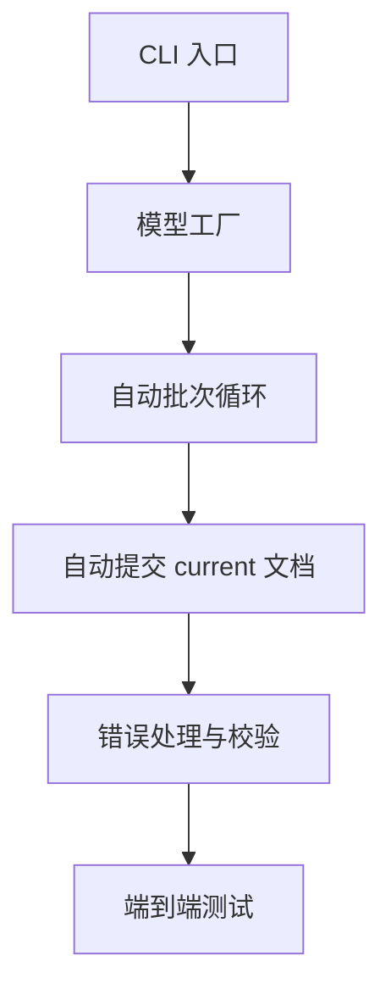

# EPUB 转 YAML 最小化可用版本阶段任务拆分

## 1. 阶段目标

本阶段目标是实现一个最小化可用版本：

- 输入单个 EPUB 文件
- 自动提取章节文本
- 自动按批次调用模型生成 Delta
- 自动将 Delta 合并到当前文档
- 最终输出正式 YAML 文档
- 暂不实现人工审阅、拒绝重试、断点恢复

最终交付结果应满足：

- 用户可以通过单个 CLI 命令完成从 EPUB 到 YAML 的转换
- 系统输出 `actors.yaml` 与 `worldinfo.yaml`
- 失败时给出明确错误信息
- 具备最小端到端测试覆盖

## 2. 范围边界

### 包含范围

- 单本 EPUB 处理
- 自动章节提取
- 自动批处理
- LangChain 模型调用
- LangGraph 无人工分支主流程
- Delta 解析与合并
- 最终 YAML 落盘
- 基础结构校验

### 不包含范围

- 人工审阅
- 拒绝后重试
- 断点恢复
- Web UI
- 多书并行处理
- 数据库存储
- 复杂 schema 系统

## 3. 阶段拆分

### 阶段 A：CLI 与运行入口

目标：提供一个可以直接执行的最小命令入口。

任务：

1. 在 CLI 中新增最小命令，例如 `generate-yaml`
2. 定义命令输入参数
   - EPUB 路径
   - 输出目录或 book_id
   - 模型配置来源
3. 定义命令输出行为
   - 成功时输出结果路径
   - 失败时输出错误信息

完成标志：

- 用户可以从命令行直接触发完整流程

### 阶段 B：模型配置与初始化

目标：让系统可以真正调用可用模型，而不是仅依赖测试假模型。

任务：

1. 新增模型配置读取入口
2. 支持从环境变量读取必要配置
3. 新增模型工厂模块
4. 返回可注入 [`DocumentUpdateChain`](../src/epub2yaml/llm/chains/document_update_chain.py) 的聊天模型实例

完成标志：

- CLI 可用真实模型配置启动

### 阶段 C：自动批次执行服务

目标：从单批处理扩展到整本书自动处理完成。

任务：

1. 在应用服务层新增自动批次循环入口
2. 从 [`RunState`](../src/epub2yaml/domain/models.py) 判断剩余章节
3. 循环执行生成、解析、合并、提交
4. 全部章节处理完成后输出最终状态

完成标志：

- 单次命令可以处理完整本书，而不是仅处理一批

### 阶段 D：无审阅自动提交路径

目标：去掉人工节点，直接将每批结果提交到正式文档。

任务：

1. 在工作流或服务层增加自动提交路径
2. 每批生成完成后直接更新 `current/actors.yaml`
3. 每批生成完成后直接更新 `current/worldinfo.yaml`
4. 保留必要的中间产物便于排错
5. 更新最终运行状态

完成标志：

- 处理结束后 `current/` 目录中存在最终正式 YAML

### 阶段 E：最小校验与错误处理

目标：确保最小版本输出稳定且可诊断。

任务：

1. 校验 Delta YAML 根节点
2. 校验 `delta.actors` 与 `delta.worldinfo` 类型
3. 校验合并后的 `actors` 与 `worldinfo` 根节点类型
4. 对模型调用失败给出明确报错
5. 对 YAML 解析失败给出明确报错

完成标志：

- 常见失败场景能够终止流程并给出可读错误

### 阶段 F：测试补齐

目标：保证最小版本具备端到端可验证性。

任务：

1. 新增 CLI 级别测试或服务级端到端测试
2. 覆盖从 EPUB 输入到最终 YAML 输出的完整流程
3. 增加模型输出非法 YAML 的失败测试
4. 增加空章节或无可处理章节的失败测试

完成标志：

- 最小版本关键路径具备自动化测试

## 4. 关键文件拆分建议

优先修改：

- [`src/epub2yaml/app/cli.py`](../src/epub2yaml/app/cli.py)
- [`src/epub2yaml/app/services.py`](../src/epub2yaml/app/services.py)
- [`src/epub2yaml/workflow/graph.py`](../src/epub2yaml/workflow/graph.py)

建议新增：

- `src/epub2yaml/llm/model_factory.py`
- `tests/test_mvp_pipeline.py`

可复用现有模块：

- [`src/utils/epub_extract.py`](../src/utils/epub_extract.py)
- [`src/epub2yaml/domain/services.py`](../src/epub2yaml/domain/services.py)
- [`src/epub2yaml/infra/yaml_store.py`](../src/epub2yaml/infra/yaml_store.py)
- [`src/epub2yaml/infra/state_store.py`](../src/epub2yaml/infra/state_store.py)

## 5. 建议执行顺序

## 6. 阶段完成定义

当以下条件全部满足时，本阶段可视为完成：

- 可以执行单命令处理单本 EPUB
- 运行结束后生成正式 [`actors.yaml`](../src/epub2yaml/infra/yaml_store.py) 与 [`worldinfo.yaml`](../src/epub2yaml/infra/yaml_store.py)
- 不依赖人工审阅
- 至少具备一条成功路径测试
- 至少具备一条失败路径测试
