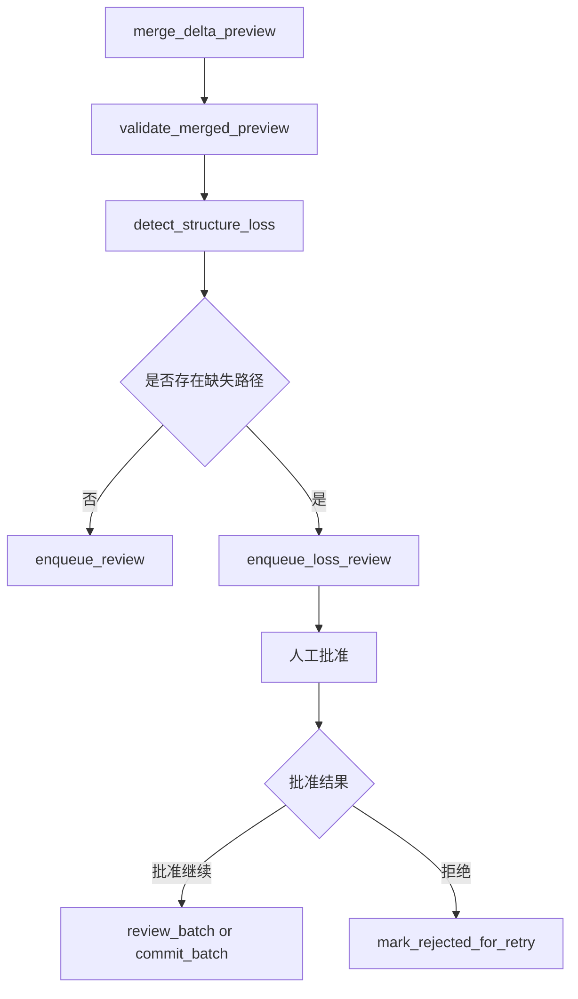
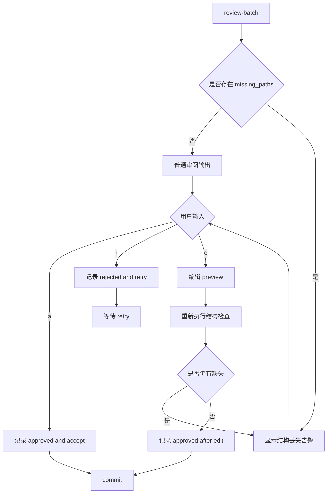

# 输出结构检查与人工审阅计划

## 1. 目标

在现有批处理链路基础上，引入一层基于上一次正式结果结构的输出完整性检查，用来识别 LLM 输出在结构层面是否发生数据丢失。

本次确认的判定规则如下：

- 基于 YAML 或 JSON 的键路径进行结构比对
- 仅检查字段缺失
- 不检查字段值变化
- 当检测到缺失时，不直接自动提交
- 必须进入人工批准门控
- 若人工拒绝，则当前批次进入重试路径

## 2. 当前代码接入点

当前工作流主链路位于 [`run_batch_generation_workflow()`](../src/epub2yaml/workflow/graph.py:120)，执行顺序大致为：

1. `prepare_batch`
2. `load_current_documents`
3. `build_prompt`
4. `invoke_llm`
5. `parse_delta_output`
6. `merge_delta_preview`
7. `validate_merged_preview`
8. `enqueue_review`

当前失败信息由 [`_handle_failure()`](../src/epub2yaml/workflow/graph.py:460) 统一落盘。

当前审阅队列与历史由 [`ReviewQueueStore`](../src/epub2yaml/infra/review_store.py) 管理。

当前人工审阅入口实际复用 [`PipelineService.review_batch()`](../src/epub2yaml/app/services.py:208) 和 [`PipelineService.commit_batch()`](../src/epub2yaml/app/services.py:285)，CLI 入口在 [`review_batch`](../src/epub2yaml/app/cli.py:115)。

这意味着本次需求最合适的接入位置不是替换现有审阅机制，而是在 merged preview 生成后、进入正式提交前增加一层结构丢失门控。

## 3. 目标行为定义

### 3.1 比对对象

每次批次生成完成后，对以下两组数据做结构比对：

- 上一版正式 [`actors.yaml`](../runs/) 与当前 `merged_actors.preview.yaml`
- 上一版正式 [`worldinfo.yaml`](../runs/) 与当前 `merged_worldinfo.preview.yaml`

说明：

- 基准对象使用当前已提交正式版本，而不是上一轮 Delta
- 检查对象使用合并后的 preview，而不是原始 Delta
- 这样可以直接判断 如果当前结果被提交 是否会造成结构路径丢失

### 3.2 丢失判定规则

建议新增通用结构展开函数，把任意映射结构展开成键路径集合。

示例：

```yaml
actors:
  Alice:
    profile:
      goals:
        short_term: 保护妹妹
```

展开后可得到类似路径：

- `actors.Alice`
- `actors.Alice.profile`
- `actors.Alice.profile.goals`
- `actors.Alice.profile.goals.short_term`

判定规则：

1. 从上一版正式文档提取全部键路径
2. 从当前 merged preview 提取全部键路径
3. 计算差集 `previous_paths - current_paths`
4. 若差集非空，则视为检测到结构丢失

补充约束：

- 仅递归映射路径
- 列表内部不按索引展开
- 列表字段本身作为一个路径节点参与比较
- 若字段仍存在但值类型变化，只要路径未消失，就不归类为本次数据丢失

这样与用户确认的最小规则一致，避免把值重写或列表替换误判为结构丢失。

## 4. 建议接入的工作流节点

建议在 [`_validate_merged_preview()`](../src/epub2yaml/workflow/graph.py:388) 之后新增专用步骤，例如：

1. `detect_structure_loss`
2. `route_review_gate`

推荐新链路：



设计要点：

- 不把结构丢失直接归类为普通失败
- 它是可人工决策的门控状态，而不是纯技术异常
- 仍然需要把检查结果持久化，供后续审阅与恢复使用

## 5. 状态与持久化设计

### 5.1 批次记录新增字段

建议扩展 [`BatchRecord`](../src/epub2yaml/domain/models.py:95)，增加结构检查元数据，例如：

- `structure_check_passed: bool = True`
- `missing_paths: list[str] = []`
- `requires_loss_approval: bool = False`
- `loss_approval_status: str | None = None`
- `loss_approval_comment: str | None = None`

建议的审批状态：

- `pending`
- `approved`
- `rejected`

### 5.2 运行状态新增信号

建议扩展 [`RunState`](../src/epub2yaml/domain/models.py:66)，补充能够驱动恢复与提示的信息，例如：

- `pending_loss_review_batch_id: str | None = None`
- `last_structure_check_batch_id: str | None = None`
- `last_structure_check_passed: bool | None = None`
- `recommended_action` 新增可选值 `review_structure_loss`

### 5.3 批次目录新增产物

建议在批次目录中新增结构检查产物，例如：

- `structure_check.json`
- `missing_paths.txt`
- 可选 `structure_check.summary.md`

建议落盘内容至少包括：

- 检查基准文档版本
- 检查时间
- actors 缺失路径列表
- worldinfo 缺失路径列表
- 汇总缺失路径总数
- 是否需要人工批准

### 5.4 审阅队列扩展

建议增强 [`ReviewQueueStore`](../src/epub2yaml/infra/review_store.py) 的状态表达，让队列区分普通审阅与结构缺失审阅。

建议最小方案：

- 队列条目增加 `review_kind`
- 可取值：`normal_review` 与 `structure_loss_review`
- 结构缺失场景入队后默认状态仍是 `pending`
- 但 CLI 展示时必须优先输出缺失路径摘要
- 不新增独立审批命令，统一复用 [`review_batch`](../src/epub2yaml/app/cli.py:115)

这样可以尽量复用现有审阅入口，而不强行拆成一套完全独立的新命令。

## 6. 人工审阅交互定义

根据最新确认，人工审阅采用单命令交互：继续使用 [`review_batch`](../src/epub2yaml/app/cli.py:115)，在终端中展示结构丢失告警和缺失路径，再由用户输入 `(a)ccept` `(r)eject` `(e)dit`。

### 6.1 交互入口

建议 CLI 保持单入口：

- `review-batch <batch_id>`

当目标批次存在 `missing_paths` 时，该命令进入结构丢失告警模式；当不存在 `missing_paths` 时，则保持普通审阅模式。

### 6.2 终端交互流程

建议 [`review_batch`](../src/epub2yaml/app/cli.py:115) 按以下顺序输出：

1. 批次基础信息
   - `batch_id`
   - 章节范围
   - 当前状态
   - `retry_count`
2. 结构检查摘要
   - 是否检测到结构丢失
   - 缺失路径总数
   - `actors` 缺失数量
   - `worldinfo` 缺失数量
3. 高优先级告警
   - 明确提示 当前结果相较上一版正式文档存在字段缺失
   - 明确提示 若继续接受，将以人工批准方式放行提交
4. 路径明细
   - 默认显示前 N 条缺失路径
   - 若超出上限，提示查看 `structure_check.json` 或 `missing_paths.txt`
5. 相关文件路径
   - `delta.yaml`
   - `merged_actors.preview.yaml`
   - `merged_worldinfo.preview.yaml`
   - `structure_check.json`
6. 操作提示
   - `[a] accept and continue`
   - `[r] reject and retry later`
   - `[e] edit preview before commit`

建议交互文案强调：

- `a` 不是忽略告警，而是人工确认 允许当前缺失结果继续提交
- `r` 会把当前批次标记为拒绝，并进入重试语义
- `e` 会先进入人工修订，再以修订后的 preview 作为提交基础

### 6.3 动作语义映射

建议定义如下：

#### 输入 `a`

表示：

- 人工已查看缺失路径
- 认可这是可接受的结构变化，或确认不属于真实数据丢失
- 允许当前 merged preview 继续走提交路径

系统行为：

- 写入结构审批结果 `approved`
- 写入审阅决策 `accept`
- 调用现有提交逻辑
- 更新 `current/` 与历史版本

#### 输入 `r`

表示：

- 人工确认当前缺失不可接受
- 不允许当前结果提交
- 当前批次应等待重试

系统行为：

- 写入结构审批结果 `rejected`
- 批次状态记为 `rejected`
- `recommended_action` 设置为 `retry_failed_batch`
- 保留本次产物供对比和追溯
- 不更新正式 `current/` 文档

#### 输入 `e`

表示：

- 人工认为当前自动结果有问题，但希望直接修订 preview 后提交
- 修订后的结果应重新通过结构检查，再执行提交

系统行为：

- 打开或提示编辑 `merged_actors.preview.yaml` 与 `merged_worldinfo.preview.yaml`
- 重新运行结构缺失检测
- 若修订后仍有缺失，则再次展示告警并要求重新确认
- 若修订后通过，则记录结构审批结果 `approved_after_edit` 或等价状态，并执行提交

### 6.4 建议的交互状态流转



### 6.5 交互输出格式建议

建议终端输出保持可快速扫读，示意如下：

```text
Batch: 0007
Chapters: 18-20
Status: review_required
Structure loss detected: yes
Missing paths: 5

Actors missing:
- actors.Alice.profile.goals.short_term
- actors.Bob.relationships.dynamic_with_Alice

Worldinfo missing:
- worldinfo.MagicSystem.rules.cost

Files:
- delta.yaml
- merged_actors.preview.yaml
- merged_worldinfo.preview.yaml
- structure_check.json

Action:
[a] accept and continue
[r] reject and retry later
[e] edit preview before commit
```

### 6.6 拒绝后的行为

若用户在结构丢失告警场景下选择 `r`：

- 当前批次状态记为 `rejected`
- 记录结构丢失拒绝原因
- `recommended_action` 设置为 `retry_failed_batch`
- 不更新正式 `current/` 文档
- 允许后续通过 [`retry_batch`](../src/epub2yaml/app/cli.py:100) 或 [`resume_run`](../src/epub2yaml/app/cli.py:80) 重新进入该批次

这与现有拒绝后重试语义保持一致，降低实现复杂度。

## 7. 实现拆分建议

### 阶段 A：抽取结构路径检测能力

目标：得到一个可单测的纯函数层。

任务：

1. 在 [`src/epub2yaml/domain/services.py`](../src/epub2yaml/domain/services.py) 新增结构路径提取函数
2. 新增上一版文档与 merged preview 的缺失路径比较函数
3. 明确 actors 与 worldinfo 两类文档的统一输出格式
4. 约定列表字段仅比较字段路径，不展开索引

完成标志：

- 给定两份 YAML 映射文档，可稳定返回缺失路径列表

### 阶段 B：把结构检查接入工作流

目标：让工作流在 merged preview 校验通过后自动执行结构丢失检测。

任务：

1. 扩展 [`GraphState`](../src/epub2yaml/workflow/graph.py:19)
2. 新增 `missing_paths` 与结构检查结果字段
3. 在 [`build_pipeline_graph()`](../src/epub2yaml/workflow/graph.py:56) 中插入 `detect_structure_loss`
4. 将检查结果写入批次产物和批次记录
5. 根据结果设置不同 `recommended_action`

完成标志：

- 结构丢失信息会随着批次一起落盘并可恢复

### 阶段 C：增强审阅队列与应用服务语义

目标：让服务层能识别 这是普通待审阅 还是结构缺失待批准。

任务：

1. 扩展 [`ReviewQueueStore`](../src/epub2yaml/infra/review_store.py)
2. 扩展 [`PipelineService`](../src/epub2yaml/app/services.py) 的恢复决策逻辑
3. 让 [`PipelineService.resume_run()`](../src/epub2yaml/app/services.py:63) 优先返回结构缺失待审批批次
4. 让 [`PipelineService.commit_batch()`](../src/epub2yaml/app/services.py:285) 在提交前校验丢失审批状态

完成标志：

- 未经人工批准的结构丢失批次无法被误提交

### 阶段 D：更新 CLI 交互

目标：让用户在命令行清楚看到 丢了哪些路径 以及下一步该怎么处理。

任务：

1. 扩展 [`src/epub2yaml/app/cli.py`](../src/epub2yaml/app/cli.py)
2. 在 [`resume_run`](../src/epub2yaml/app/cli.py:80) 输出中显示结构缺失待审批状态
3. 在 [`review_batch`](../src/epub2yaml/app/cli.py:115) 中优先展示 `missing_paths`
4. 对 `accept` `reject` `edit` 增加结构缺失场景说明
5. 对拒绝场景明确提示可使用 [`retry_batch`](../src/epub2yaml/app/cli.py:100)

完成标志：

- 用户无需查看底层 JSON 即可完成结构缺失批准或拒绝

### 阶段 E：补齐测试

目标：确保结构检查不会破坏现有恢复与重试行为。

建议补测文件：

- [`tests/test_domain_services.py`](../tests/test_domain_services.py)
- [`tests/test_llm_workflow.py`](../tests/test_llm_workflow.py)
- [`tests/test_app_services.py`](../tests/test_app_services.py)
- [`tests/test_mvp_pipeline.py`](../tests/test_mvp_pipeline.py)

关键场景：

1. 结构完全一致时不触发审批
2. merged preview 缺失单个深层路径时生成 `missing_paths`
3. 同一路径值变化但路径仍存在时不误报
4. 列表内容变化但列表字段路径仍存在时不误报
5. 结构缺失批次未经批准无法提交
6. 结构缺失批次人工接受后可以正常提交
7. 结构缺失批次人工拒绝后进入重试路径
8. `resume-run` 优先返回待结构审批批次
9. 重试后新结果不缺路径时可恢复正常流程

## 8. 关键实现决策

### 8.1 为什么比较 merged preview 而不是 Delta

因为 Delta 本身就是局部更新结构，天然会缺少大量旧路径。只有比较 merged preview，才能判断最终将被提交的完整结果是否真的丢字段。

### 8.2 为什么不把结构丢失直接当失败

因为本需求明确要求 发现丢失时先要求人工批准。说明它不是纯技术错误，而是一个需要人工裁定的风险信号。

### 8.3 为什么仍复用现有审阅入口

当前 [`PipelineService.review_batch()`](../src/epub2yaml/app/services.py:208) 与 [`PipelineService.commit_batch()`](../src/epub2yaml/app/services.py:285) 已具备接受 拒绝 编辑的基本语义。首版在其上叠加结构缺失提示，能最小化改动范围。

## 9. 推荐修改文件清单

优先修改：

- [`src/epub2yaml/domain/models.py`](../src/epub2yaml/domain/models.py)
- [`src/epub2yaml/domain/services.py`](../src/epub2yaml/domain/services.py)
- [`src/epub2yaml/workflow/graph.py`](../src/epub2yaml/workflow/graph.py)
- [`src/epub2yaml/infra/review_store.py`](../src/epub2yaml/infra/review_store.py)
- [`src/epub2yaml/infra/state_store.py`](../src/epub2yaml/infra/state_store.py)
- [`src/epub2yaml/app/services.py`](../src/epub2yaml/app/services.py)
- [`src/epub2yaml/app/cli.py`](../src/epub2yaml/app/cli.py)

优先补测：

- [`tests/test_domain_services.py`](../tests/test_domain_services.py)
- [`tests/test_llm_workflow.py`](../tests/test_llm_workflow.py)
- [`tests/test_app_services.py`](../tests/test_app_services.py)
- [`tests/test_mvp_pipeline.py`](../tests/test_mvp_pipeline.py)

## 10. 供实现模式直接执行的待办清单

- [ ] 在 [`src/epub2yaml/domain/services.py`](../src/epub2yaml/domain/services.py) 实现键路径提取与缺失路径比较函数
- [ ] 扩展 [`BatchRecord`](../src/epub2yaml/domain/models.py:95) 与 [`RunState`](../src/epub2yaml/domain/models.py:66)，加入结构检查与审批状态字段
- [ ] 在 [`build_pipeline_graph()`](../src/epub2yaml/workflow/graph.py:56) 中插入结构丢失检测节点，并扩展 [`GraphState`](../src/epub2yaml/workflow/graph.py:19)
- [ ] 在批次目录落盘 `structure_check.json` 等检查产物
- [ ] 扩展 [`ReviewQueueStore`](../src/epub2yaml/infra/review_store.py) 的 `review_kind` 与相关查询能力
- [ ] 在 [`PipelineService.resume_run()`](../src/epub2yaml/app/services.py:63) 和 [`PipelineService.commit_batch()`](../src/epub2yaml/app/services.py:285) 中接入结构缺失门控
- [ ] 在 [`review_batch`](../src/epub2yaml/app/cli.py:115) 命令输出中加入缺失路径摘要与审批提示
- [ ] 补充结构缺失场景的 domain workflow service CLI 测试
- [ ] 更新 [`plans/epub-to-yaml-design.md`](./epub-to-yaml-design.md) 以同步最新设计
