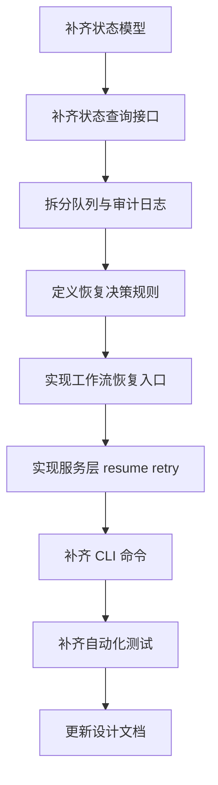

# EPUB 转 YAML 状态恢复与失败重试阶段计划

## 1. 文档目标

在 [`plans/mvp-stage-plan.md`](plans/mvp-stage-plan.md) 的最小自动版目标基础上，结合当前代码状态，下一阶段不再把 CLI 单命令、自动批处理、自动提交、模型工厂作为主任务，而是把重点收敛到两条主线：

- 状态保存和恢复
- 失败重试

本计划用于替代此前已过时的最小自动版缺口判断，并作为下一步切换到实现模式时的直接执行清单。

## 2. 当前实现重新确认

经核对，以下能力已经具备基础实现：

- CLI 单命令入口已存在于 [`generate_yaml`](src/epub2yaml/app/cli.py:54)
- 自动批次循环已存在于 [`run_to_completion()`](src/epub2yaml/app/services.py:95)
- 自动提交路径已存在于 [`commit_batch()`](src/epub2yaml/app/services.py:204)
- 模型工厂已存在于 [`create_document_update_chain_from_env()`](src/epub2yaml/llm/model_factory.py:69)
- 最小端到端测试已存在于 [`tests/test_mvp_pipeline.py`](tests/test_mvp_pipeline.py)

这意味着下一阶段的核心问题已经从 能否跑通最小自动链路，转向 能否在中断和失败后可靠继续。

## 3. 当前缺口判断

### 3.1 状态保存的缺口

当前 [`RunState`](src/epub2yaml/domain/models.py:57) 仅能表达粗粒度运行状态，能记录：

- 当前章节推进位置
- 最近一次已接受批次
- 当前正式文档版本号
- 批处理预算参数

但还不能可靠表达以下恢复所需信息：

- 最近生成但尚未提交的批次
- 最近失败批次
- 最近失败阶段
- 最近失败原因
- 当前推荐恢复动作
- 是否存在待审阅批次
- 指定批次是否已经重试过

### 3.2 状态查询能力的缺口

当前 [`StateStore`](src/epub2yaml/infra/state_store.py:11) 主要提供顺序写入能力：

- 写入 [`run_state.json`](src/epub2yaml/infra/state_store.py:23)
- 追加 [`checkpoints.jsonl`](src/epub2yaml/infra/state_store.py:81)
- 保存批次输入与批次记录

但缺少恢复流程真正需要的查询接口，例如：

- 查询最近检查点
- 读取指定批次记录
- 列出失败批次
- 查找待恢复批次
- 判断是否存在待审阅批次

因此目前的持久化更像审计日志，而不是恢复驱动数据结构。

### 3.3 失败重试的缺口

当前失败路径集中在 [`_handle_failure()`](src/epub2yaml/workflow/graph.py:382)。其行为主要是：

- 将批次记录置为 failed
- 将运行状态置为 failed
- 追加一个失败检查点

但还缺少：

- 失败阶段枚举
- 失败原因结构化落盘
- 可重试与不可重试的区分
- 最近失败批次的直接定位能力
- 服务层和 CLI 层的 retry 入口

### 3.4 队列语义的缺口

当前 [`ReviewQueueStore`](src/epub2yaml/infra/review_store.py:9) 将入队和审阅结果都写入同一个 [`review_queue.jsonl`](runs/) 追加日志中，这会导致：

- 队列状态与审计历史耦合
- 难以判断当前仍待审阅的批次集合
- 难以判断拒绝批次是否已重试
- 恢复时难以选择正确优先级

## 4. 下一阶段目标

本阶段完成后，系统应具备以下能力：

1. 运行中断后，可以基于已保存状态恢复到正确位置
2. 若存在待审阅批次，恢复时优先回到待审阅批次
3. 若最近批次失败，可直接定位失败点并执行重试
4. 支持重试最近失败批次与重试指定批次
5. 重试不会污染 [`actors.yaml`](src/epub2yaml/infra/yaml_store.py) 与 [`worldinfo.yaml`](src/epub2yaml/infra/yaml_store.py)
6. 恢复与重试后的版本号、章节推进位置、批次编号保持一致性

## 5. 范围边界

### 包含范围

- 运行状态增强
- 批次状态增强
- 恢复决策规则
- 失败结构化落盘
- resume 接口
- retry 接口
- CLI 恢复命令与重试命令
- 恢复与重试自动化测试
- 设计文档同步更新

### 不包含范围

- Web UI 审阅台
- 多书并发恢复调度
- 数据库存储迁移
- 图内长期挂起等待节点
- 复杂 schema 校验体系扩展

## 6. 实施拆分

### 阶段 A：恢复所需状态模型补齐

目标：让运行态和批次态足以支撑恢复决策，而不只是一份简单进度快照。

任务：

1. 扩展 [`RunState`](src/epub2yaml/domain/models.py:57)
2. 增加最近生成批次、最近失败批次、最近失败阶段、最近恢复动作等字段
3. 明确批次记录中是否需要补充 retry 次数、最近决策、失败摘要
4. 定义哪些字段属于运行快照，哪些字段属于批次事实记录

完成标志：

- 单看 [`run_state.json`](src/epub2yaml/infra/state_store.py:23) 与批次记录，即可判断系统下一步应该 resume 还是 retry

### 阶段 B：状态读取与恢复查询接口

目标：让存储层可直接回答 恢复哪里 重试哪个批次，而不是要求服务层自己扫描日志。

任务：

1. 在 [`StateStore`](src/epub2yaml/infra/state_store.py:11) 增加最近检查点读取接口
2. 增加指定批次记录读取接口
3. 增加失败批次枚举接口
4. 增加待恢复批次查找接口
5. 增加待审阅批次定位接口

完成标志：

- 服务层可以通过存储接口直接得到恢复候选对象与失败候选对象

### 阶段 C：审阅队列与状态日志解耦

目标：把 当前待处理队列 和 历史审计日志 拆开，避免恢复决策依赖日志回放。

任务：

1. 重构 [`ReviewQueueStore`](src/epub2yaml/infra/review_store.py:9) 的数据职责
2. 区分 待审阅 已接受 已拒绝 已重试 等状态表达
3. 明确是否保留独立队列文件与独立历史日志文件
4. 定义拒绝后进入 retry 的状态迁移规则

完成标志：

- 可以明确查询 当前待审阅批次 集合，而不是依赖 [`review_queue.jsonl`](runs/) 人工推断

### 阶段 D：工作流恢复入口与失败元数据

目标：工作流不仅能处理新批次，也能从已有批次上下文恢复或重试。

任务：

1. 为 [`run_batch_generation_workflow()`](src/epub2yaml/workflow/graph.py:105) 增加恢复入口参数
2. 支持从已有批次输入继续执行，而不是总是重新构建下一批
3. 在失败路径 [`_handle_failure()`](src/epub2yaml/workflow/graph.py:382) 中落盘结构化失败信息
4. 记录失败阶段、错误摘要、可重试标记、建议下一动作
5. 保证失败后已有中间产物可供后续重试复用

完成标志：

- 同一批次可以在不重建新批次编号的前提下重复执行失败后的后续阶段

### 阶段 E：服务层 resume 与 retry 语义

目标：把 恢复未完成运行 和 重试失败批次 变成明确的应用服务接口。

任务：

1. 在 [`PipelineService`](src/epub2yaml/app/services.py:20) 新增 resume 接口
2. 新增 retry last failed 接口
3. 新增 retry specified batch 接口
4. 明确三类入口的优先级与前置校验
5. 明确哪些场景沿用旧中间产物，哪些场景要求重新调用模型

完成标志：

- 服务层可以清晰区分 continue new batch、resume pending batch、retry failed batch 三种路径

### 阶段 F：CLI 命令补齐

目标：让用户能在命令行直接恢复运行与触发重试。

任务：

1. 在 [`src/epub2yaml/app/cli.py`](src/epub2yaml/app/cli.py) 增加 `resume-run`
2. 增加 `retry-last-failed`
3. 增加 `retry-batch <batch_id>`
4. 统一输出当前恢复决策、目标批次、下一步动作
5. 在错误场景输出不可恢复原因

完成标志：

- 用户无需手工修改状态文件即可继续未完成任务或重试失败批次

### 阶段 G：测试补齐

目标：验证恢复与重试不会破坏版本连续性与正式文档一致性。

任务：

1. 扩展 [`tests/test_mvp_pipeline.py`](tests/test_mvp_pipeline.py) 或新增恢复专项测试
2. 覆盖初始化后中断恢复
3. 覆盖生成失败后重试
4. 覆盖审阅拒绝后重试
5. 覆盖指定批次重试
6. 覆盖重复恢复幂等性
7. 覆盖恢复后版本号与章节索引连续性

完成标志：

- 关键恢复与重试路径具备自动化验证

### 阶段 H：文档回写

目标：让设计文档反映真实代码状态与新的推进重点。

任务：

1. 更新 [`plans/epub-to-yaml-design.md`](plans/epub-to-yaml-design.md)
2. 把已完成的最小自动版能力标记为已落地
3. 删除过时的 最小自动版仍缺这些 的表述
4. 单列 恢复与重试 作为新的阶段性实施计划

完成标志：

- 设计文档与真实代码状态一致，不再误导后续实施顺序

## 7. 恢复决策规则

恢复入口建议遵循以下优先级：

1. 若存在待审阅批次，则优先恢复待审阅
2. 若存在失败且可重试批次，则其次进入 retry
3. 若不存在待审阅和失败批次，且尚有剩余章节，则继续生成新批次
4. 若章节已全部提交，则状态为 completed

原因：

- 避免跳过已经生成但尚未决策的批次
- 避免重复推进 [`next_chapter_index`](src/epub2yaml/domain/models.py:62)
- 避免为同一章节区间生成多个并行批次结果

## 8. 重试规则

### 8.1 可重试错误

建议至少将以下错误视为可重试：

- 模型调用失败
- 模型超时或网络异常
- YAML 解析失败
- 基础结构校验失败

### 8.2 重试模式

建议区分三种重试模式：

1. 原样重试
   - 复用原批次输入
   - 重新调用模型
2. 带外部 Delta 重试
   - 复用原批次输入
   - 由外部文件直接提供新的 Delta
3. 仅从失败后续阶段继续
   - 若模型输出已存在，可跳过重新调用模型
   - 从解析或校验阶段继续

### 8.3 安全约束

重试前必须保证：

- 不覆盖正式 [`current/actors.yaml`](runs/)
- 不覆盖正式 [`current/worldinfo.yaml`](runs/)
- 仅在新的 commit 成功后才更新正式版本
- 同一失败批次的重试产物可区分不同尝试轮次

## 9. 关键文件调整建议

优先修改：

- [`src/epub2yaml/domain/models.py`](src/epub2yaml/domain/models.py)
- [`src/epub2yaml/infra/state_store.py`](src/epub2yaml/infra/state_store.py)
- [`src/epub2yaml/infra/review_store.py`](src/epub2yaml/infra/review_store.py)
- [`src/epub2yaml/workflow/graph.py`](src/epub2yaml/workflow/graph.py)
- [`src/epub2yaml/app/services.py`](src/epub2yaml/app/services.py)
- [`src/epub2yaml/app/cli.py`](src/epub2yaml/app/cli.py)

优先补测：

- [`tests/test_mvp_pipeline.py`](tests/test_mvp_pipeline.py)
- [`tests/test_app_services.py`](tests/test_app_services.py)

建议新增：

- `tests/test_resume_retry.py`
- `plans/recovery-retry-stage-plan.md`

## 10. 建议执行顺序

## 11. 阶段完成定义

当以下条件全部满足时，本阶段可视为完成：

- 存在明确的 resume 入口
- 存在 retry last failed 与 retry specified batch 入口
- 恢复优先级可由系统自动判断
- 失败信息可结构化落盘并可查询
- 待审阅批次、失败批次、已提交批次可被明确区分
- 恢复与重试不会污染正式 YAML
- 自动化测试覆盖关键恢复与重试路径
- [`plans/epub-to-yaml-design.md`](plans/epub-to-yaml-design.md) 已同步更新

## 12. 供后续实现模式直接使用的待办清单

- [ ] 扩展 [`RunState`](src/epub2yaml/domain/models.py:57) 与批次元数据，补齐恢复与重试字段
- [ ] 为 [`StateStore`](src/epub2yaml/infra/state_store.py:11) 增加恢复查询接口
- [ ] 重构 [`ReviewQueueStore`](src/epub2yaml/infra/review_store.py:9) 的队列职责与状态表达
- [ ] 为 [`run_batch_generation_workflow()`](src/epub2yaml/workflow/graph.py:105) 增加恢复入口
- [ ] 在 [`_handle_failure()`](src/epub2yaml/workflow/graph.py:382) 中落盘结构化失败信息
- [ ] 在 [`PipelineService`](src/epub2yaml/app/services.py:20) 中实现 resume 与 retry 接口
- [ ] 在 [`src/epub2yaml/app/cli.py`](src/epub2yaml/app/cli.py) 中补齐 `resume-run` `retry-last-failed` `retry-batch`
- [ ] 补充恢复与重试自动化测试
- [ ] 更新 [`plans/epub-to-yaml-design.md`](plans/epub-to-yaml-design.md)
